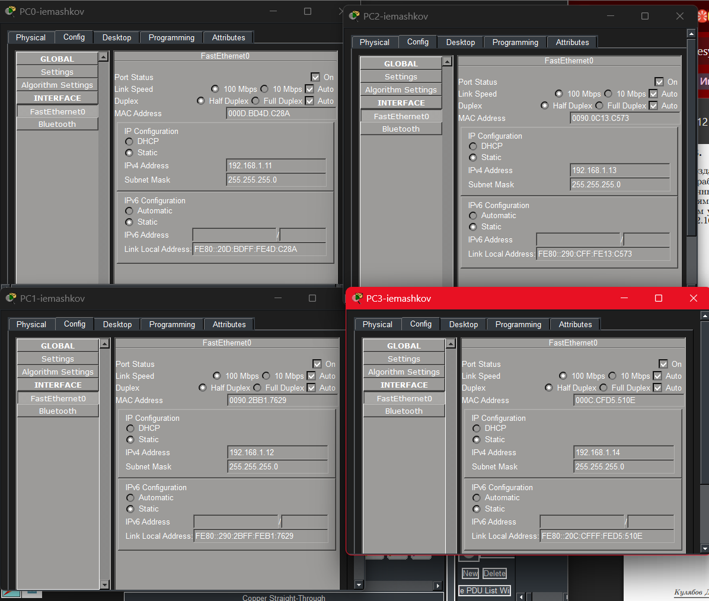
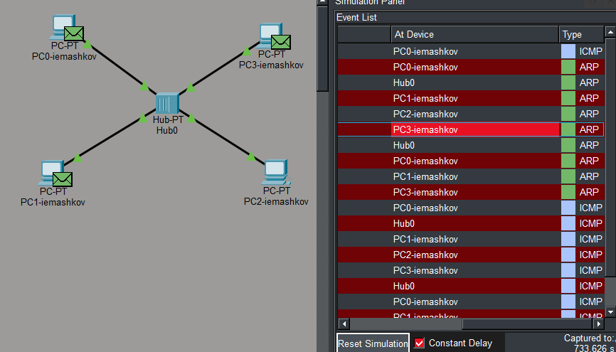
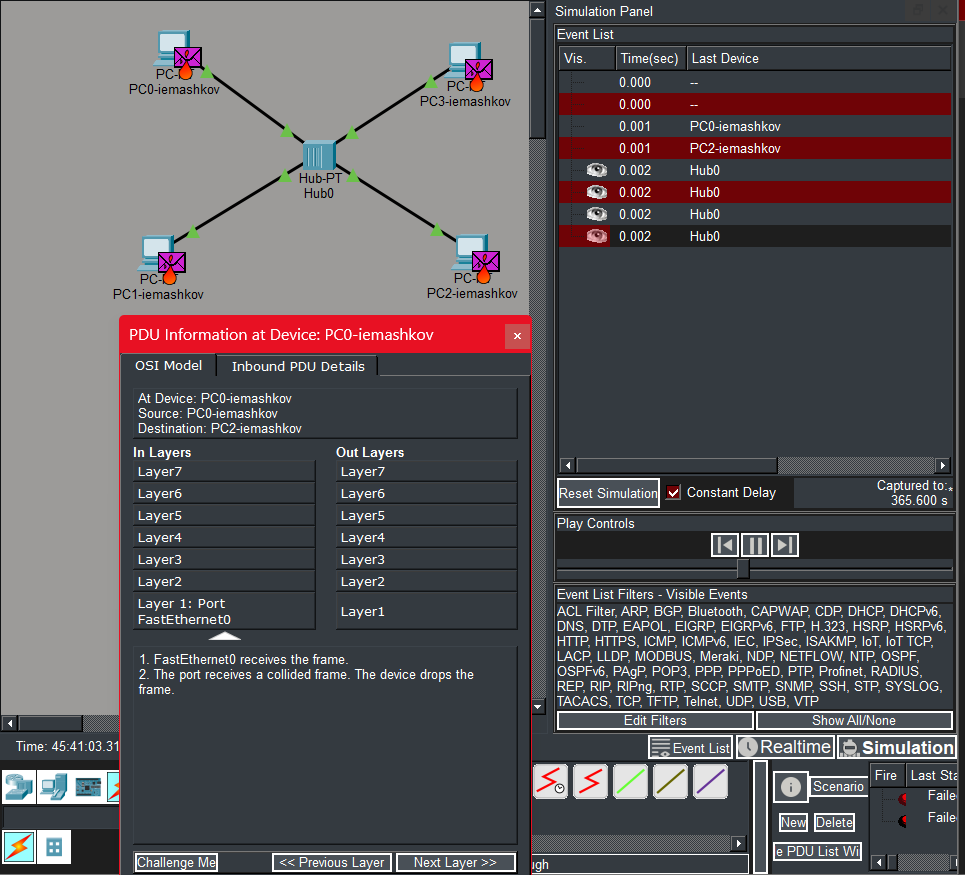
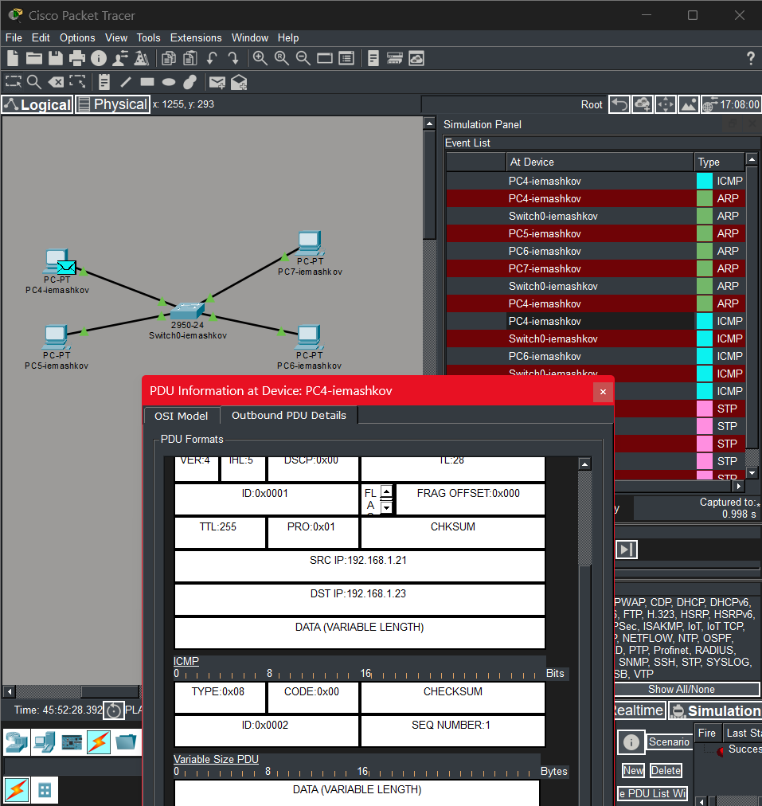
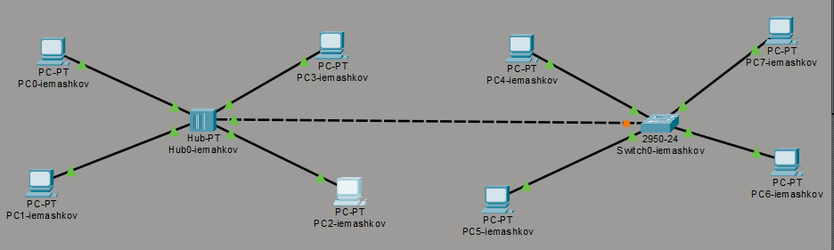
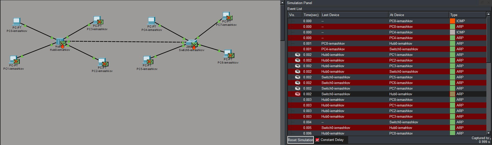
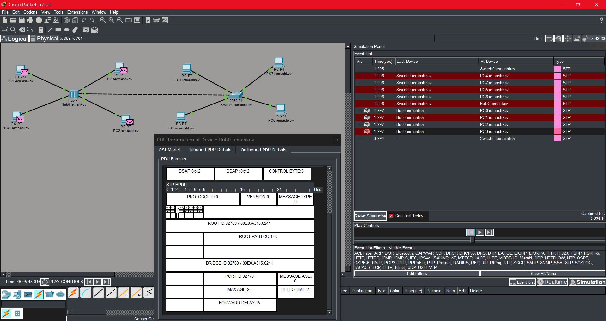
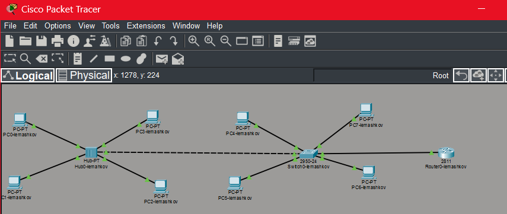
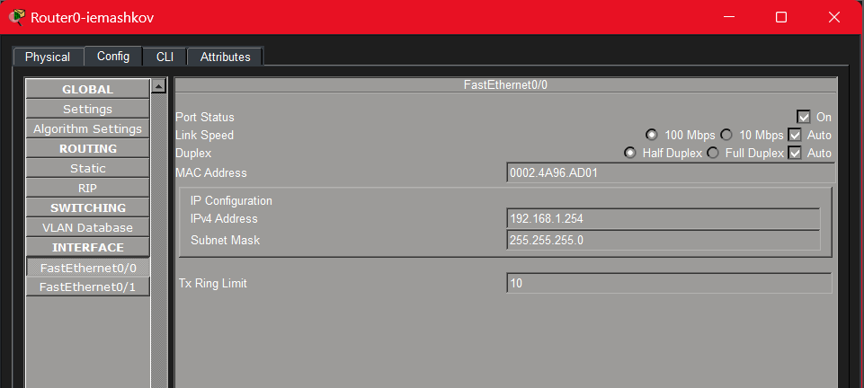
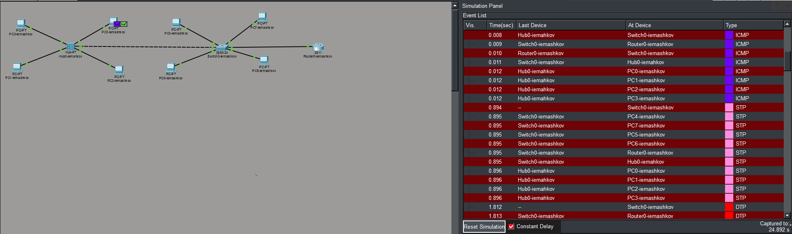

---
## Author
author:
  name: Машков Илья Евгеньевич
  email: 1132231984@yandex.ru
  affiliation:
    - name: Российский университет дружбы народов
      country: Российская Федерация
      postal-code: 117198
      city: Москва
      address: ул. Миклухо-Маклая, д. 6

## Title
title: "Лабораторная работа №1"
subtitle: "Администрирование локальных сетей"
license: "CC BY"
---

# Цель работы

Установка инструмента моделирования конфигурации сети Cisco Packet Tracer, знакомство с его интерфейсом.

# Задание

1. Установить на домашнем устройстве Cisco Packet Tracer.
2. Постройте простейшую сеть в Cisco Packet Tracer, проведите простейшую настройку оборудования.

# Выполнение лабораторной работы

Так как эту лабораторную я делаю с запозданием, Cisco Packet Tracer у меня уже был установлен согласно инструкции по его установке для Windows, изложенной в файле лабораторной работы. Поэтому сразу переходим к этапу построения простейшей сети.

Скриншот изначальной топологии я забыл сделать, но её будет видно дальше. Она состоит из четырёх оконечных устройсв, которыми являются обычные PC, и хаб, к которому они все подключаются. 

Затем выдаю для всех ПК статические ip адреса, которые были указаны в лабораторной работе ([рис. @fig-001]).

{#fig-001 width=70%}

Затем переходим к этапу симуляции нашей сети. Создаём простой сценарий, в котором поочерёдно будут отправлены два пакета: ARP и ICMP -- от PC0 до PC2 ([рис. @fig-002]). 

{#fig-002 width=70%}

В данном случае мы просматриваем информацию о ARP пакете. Можно заметить, что с PC0 пакет идёт на концентратор, а от него пересылается на все оконечные устройсва в сети. В данном случае на PC1 и PC3 пришёл заголовок(HEADER), в котором указаны ip адреса отправителя и получателя, поэтому они их и отвергают

Затем просматриваем информацию о пакете ICMP ([рис. @fig-003]).

{#fig-003 width=70%}

Видим заголовок с ip адресами отправителя и получателя, код заголовка, индентификатор и порядковый номер

На данном скриншоте видим информацию о кадре Eternet ([рис. @fig-004]). Здесь мы видим 7-ми битную преамбулу, разделитель стартового кадра (SFD), mac-адреса получателя и отправителя, type (тип протокола верхнего уровня) - 0x0800, что соответствует IPv4 и FCS полям, которое заполняется отправляющей стороной.

{#fig-004 width=70%}

Теперь удаляем прошлый сценарий и создаём новый. В нём будут оправляться те же пакеты но уже не только с PC0 на PC2, но и с PC2 на PC0 ([рис. @fig-005]).

{#fig-005 width=70%}

Видим, что у нас образовалась коллизия. Она происходит из-за одновременной отправки 2-ух запросов одновременно. Как видим по информации о PDU наш PC бросает данный пакет, по причине того, что коллизия разрушила его до его обработки.

Теперь по соседству строим такую же сеть, но не с концентратором, а с коммутатором ([рис. @fig-006]), Выдаю для оконечных устройств следующие адреса: 192.168.1.21, 192.168.1.22, 192.168.1.23, 192.168.1.24 с маской
подсети 255.255.255.0.

{#fig-006 width=70%}

Повторяем первый сценарий, но уже на новой сети ([рис. @fig-007]). В передвижении пакета ARP видим, что он тае пересылается всем устройствам, но от pc6 к pc4 он уже идёт без дополнительной пересылки.

{#fig-007 width=70%}

Также просматриваем информацию о icmp пакете. Тип - 0x08 - что соответствует эхо-запросу, ID процесса, SEQ1 - номер пакета в последовательности. Что касаемо кадра Eternet, то мы видим только изменение FCS, а остальные поля остаются такими же. Тип кадра 2, а первые 3 байта mac-адресов указывают на производителя сетевого обородувания (т.е. Cisco), а оставшиеся же отвечают за уникальный номер устройства.

Теперь соединим две наши сети кроссовым кабелем ([рис. @fig-008]).

{#fig-008 width=70%}

Теперь создаём сценарий, при котором у нас отправляются ARP и ICMP пакеты от PC0 к PC4 и от PC4 к PC0 ([рис. @fig-009]). Видим, что происходит коллизия, т.к. хаб реплицирует пакет на все порты, кроме отправителя, в итоге в хабе одномоментно оказываются 2 пакета и они уничтожаются. После чего коммутатор, зная mac-адрес PC4 оправляет пакет строго по заданному маршруту. 

{#fig-009 width=70%}

Затем мы просто очищаем прошлый сценарий и запускаем симуляцию. В таком случае с коммутатора будет происходить отправка STP пакета ([рис. @fig-010]). При изучении его структуры, видим, что Ethernet кадр имеет тип 802.3. Также видим поле LEN, вместо type, что обознает длину данных, а тип теперь указывается в LLC. MAC-адрес указывает на порт коммутатора, отправившего BPDU, а mac получателя - multicast. 

{#fig-010 width=70%}

Теперь добавляем в нашу сеть маршрутизатор 2811 ([рис. @fig-011]).

{#fig-011 width=70%}

Задаю ip-адрес 192.168.1.254 с маской 255.255.255.0 и активирую порт, поставив галочку «On» напротив «Port Status» ([рис. @fig-012]). 

{#fig-012 width=70%}

Запускаем симуляцию отправки ARP, ICMP, STP пакетов с PC3 на маршрутизатор ([рис. @fig-013]). 

{#fig-013 width=70%}

# Выводы

Во время выполнения данной лабораторной работы я получил навыки по установке Cisco Packet Tracer и построению простейшей сети.
