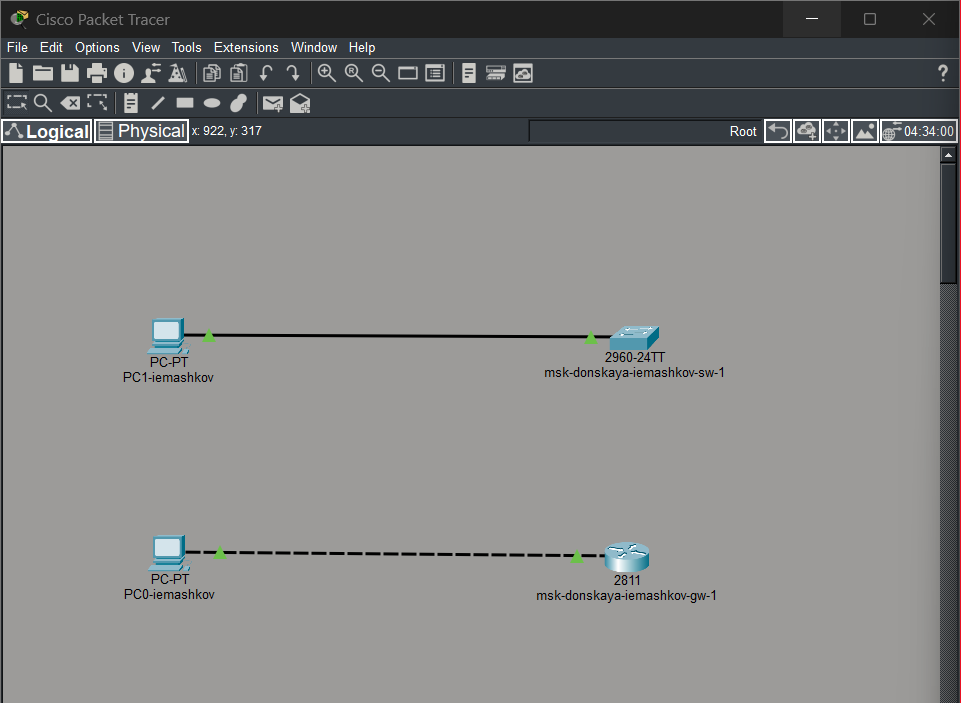
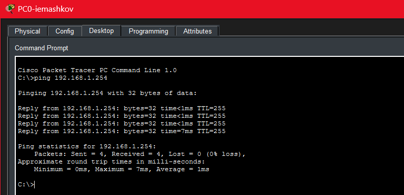

---
## Author
author:
  name: Машков Илья Евгеньевич
  email: 1132231984@yandex.ru
  affiliation:
    - name: Российский университет дружбы народов
      country: Российская Федерация
      postal-code: 117198
      city: Москва
      address: ул. Миклухо-Маклая, д. 6

## Title
title: "Лабораторная работа №2"
subtitle: "Администрирование локальных сетей"
license: "CC BY"
---

# Цель работы

Получить основные навыки по начальному конфигурированию оборудования Cisco.

# Задание

1. Сделать предварительную настройку маршрутизатора:
– задать имя в виде «город-территория-учётная_запись-тип_оборудования-номер», например msk-donskaya-osbender-gw-1;
– задать интерфейсу Fast Ethernet с номером 0 ip-адрес 192.168.1.254
и маску 255.255.255.0, затем поднять интерфейс;
– задать пароль для доступа к привилегированному режиму (сначала в открытом виде, затем — в зашифрованном);
– настроить доступ к оборудованию сначала через telnet, затем — через ssh (используя в качестве имени домена donskaya.rudn.edu);
– сохранить и экспортировать конфигурацию в отдельный файл.
2. Сделать предварительную настройку коммутатора:
– задать имя в виде «город-территория-учётная_запись-тип_оборудования-номер», например msk-donskaya-osbender-sw-1;
– задать интерфейсу vlan 2 ip-адрес 192.168.2.1 и маску 255.255.255.0, затем поднять интерфейс;
– привязать интерфейс Fast Ethernet с номером 1 к vlan 2;
– задать в качестве адреса шлюза по умолчанию адрес 192.168.2.254;
– задать пароль для доступа к привилегированному режиму (сначала в открытом виде, затем — в зашифрованном);
– настроить доступ к оборудованию сначала через telnet, затем — через ssh (используя в качестве имени домена donskaya.rudn.edu);
– для пользователя admin задать доступ 1-го уровня по паролю;
– сохранить и экспортировать конфигурацию в отдельный файл.

# Выполнение лабораторной работы

Размещаем два пк(PC0-iemashkov и PC1-iemashkov), комутатор(msk-donskaya-iemashkov-sw-1) и маршрутизатор(msk-donskaya-iemashkov-gw-1). Соединяем PC0 с маршрутизатором, а PC1 с коммутатором ([рис. @fig-001]).

{#fig-001 width=70%}

Затем выполняем предварительную настройку маршрутизатора: задаём имя (msk-donskaya-iemashkov-gw-1), ip-адрес для порта f0/0 (192.168.1.254 с маской 255.255.255.0), задаём пароль для доступа к привелегированному режиму сначала в открытом виде, а затем в зашифрованном и настраиваем доступ к оборудованию через telnet, а потом ssh ([рис. @fig-002]). Конфигурационные файлы будут находиться там же, где и файл ЛР.

{#fig-002 width=70%}

Затем проводим все те же действия с коммутатором, но будет отличаться пара моментов -- имя (msk-donskaya-iemashkov-sw-1) и ip-адрес для порта f0/1 (192.168.2.1 с маской 255.255.255.0) и привязываем его к vlan2 ([рис. @fig-003]). Конфигурационный файл будет там же, где и файл ЛР.

{#fig-003 width=70%}

Затем производим проверку наших конфигураций, путём отправки эхо-запросов с PC1 на коммутатор ([рис. @fig-004]). Все пакеты успешно достигли получателя и вернулись.

{#fig-004 width=70%}

И тоже самое делаем с PC0 и маршрутизатором ([рис. @fig-005]). Проверка прошла успешно.

{#fig-005 width=70%}

Затем по консоли подключаемся к маршрутизатору и коммутатору с  соответствующих им оконечных устройств ([рис. @fig-006])

{#fig-006 width=70%}

# Выводы

В процессе выполнения данной лабораторной работы я получил навыки по первоначальному конфигурированию устройств в Cisco Packet Tracer.

