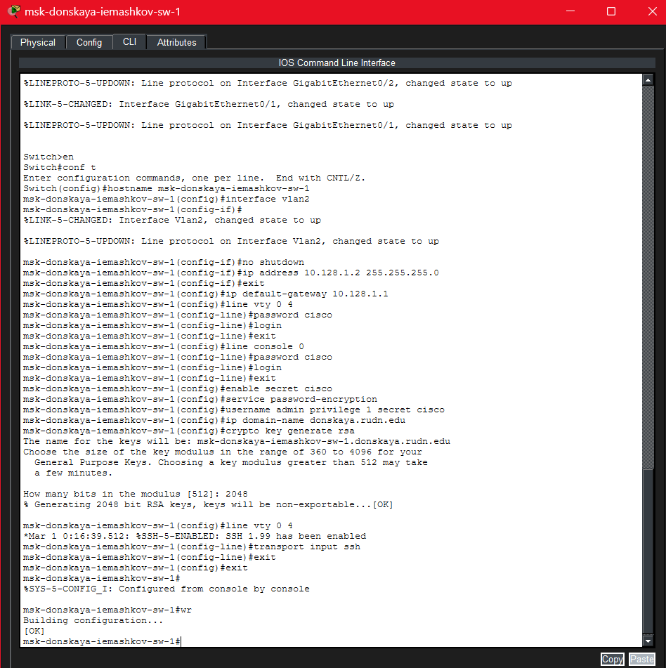
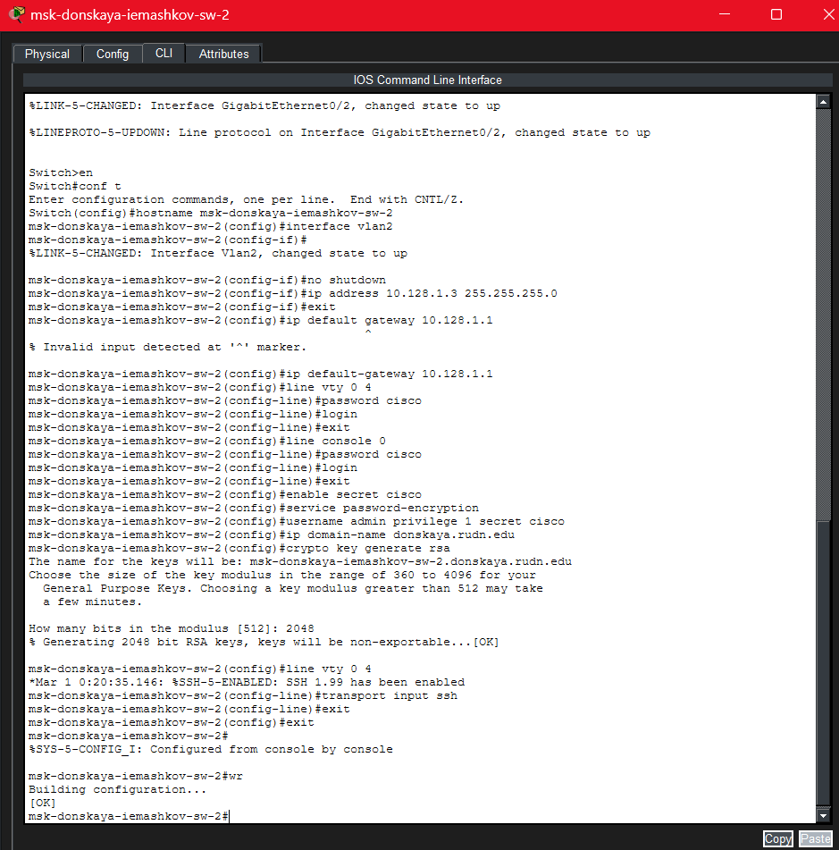

---
## Author
author:
  name: Машков Илья Евгеньевич
  email: 1132231984@yandex.ru
  affiliation:
    - name: Российский университет дружбы народов
      country: Российская Федерация
      postal-code: 117198
      city: Москва
      address: ул. Миклухо-Маклая, д. 6

## Title
title: "Лабораторная работа №4"
subtitle: "Администрирование локальных сетей"
license: "CC BY"
---

# Цель работы

Провести подготовительную работу по первоначальной настройке коммутаторов сети.

# Задание

Требуется сделать первоначальную настройку коммутаторов сети, представленной на схеме L1. Под первоначальной настройкой понимается указание имени устройства, его IP-адреса, настройка доступа по паролю к виртуальным терминалам и консоли, настройка удалённого доступа к устройству по ssh.

# Выполнение лабораторной работы

В логической области нашего проекта размещаем устройства и подключаем их друг к другу, в соответствии со схемой L1 ([рис. @fig-001]).

{#fig-001 width=70%}

Затем переходим к первоначальному конфигурированию всех коммутаторов в нашей сети. Мы задаём имя, ip-адрес (для каждого свой)  и привязывем его к vlan2, задаём шлюз (он для всех общий 10.128.1.1), задам пароль для привелигированного доступа сначала в явном виде, а затем в зашифрованном. Также настраиваем удалённый доступ по telnet и ssh.

Начинаем с настройки коммутатора в павловской([рис. @fig-002]). 

{#fig-002 width=70%}

Далее переходим к первому коммутатору в Донской ([рис. @fig-003]). 

{#fig-003 width=70%}

Затем ко второму ([рис. @fig-004]).

{#fig-004 width=70%}

Третий настраивается таким же образом ([рис. @fig-005]). 

{#fig-005 width=70%}

Четвёртый тоже настраиваем ([рис. @fig-006])

{#fig-006 width=70%}

# Выводы

В процессе выполнения данной лабораторной работы я составил начальный вид сети и настроил коммутаторы.

