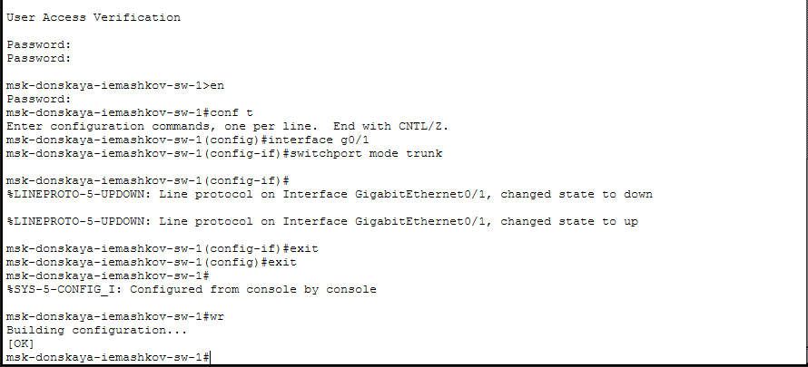
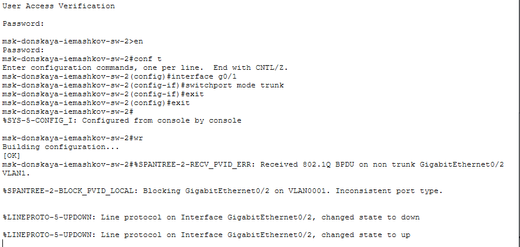
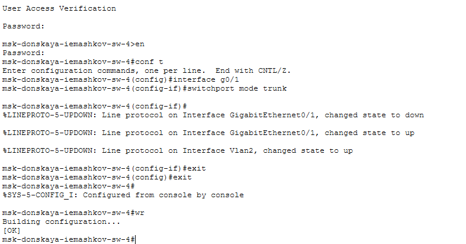
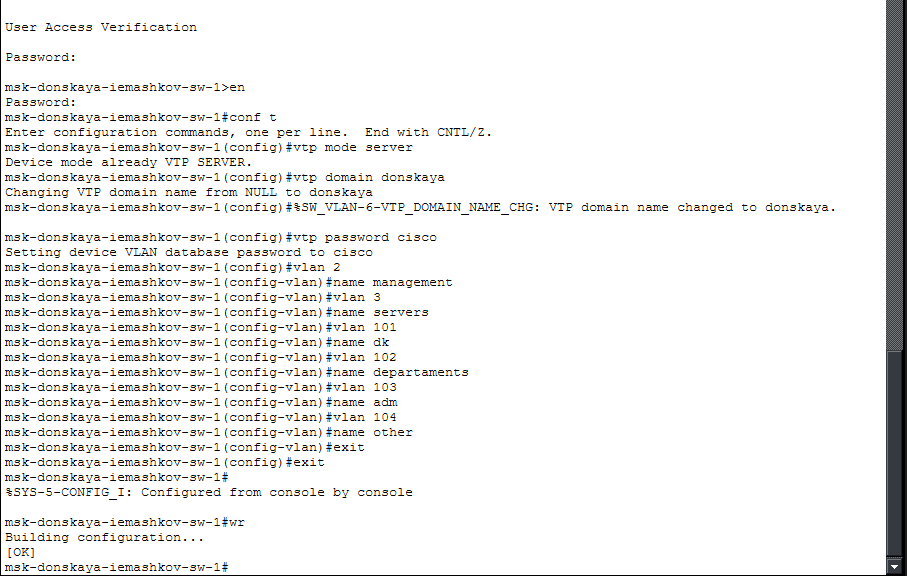
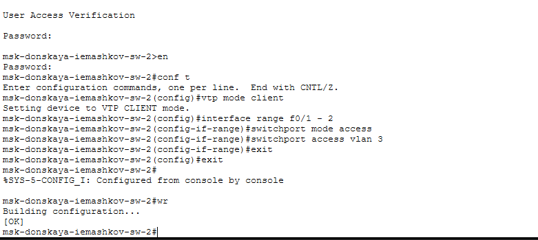
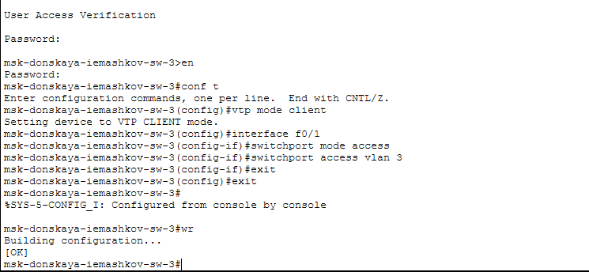
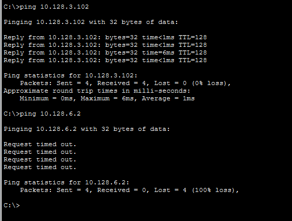

---
## Author
author:
  name: Машков Илья Евгеньевич
  email: 1132231984@yandex.ru
  affiliation:
    - name: Российский университет дружбы народов
      country: Российская Федерация
      postal-code: 117198
      city: Москва
      address: ул. Миклухо-Маклая, д. 6

## Title
title: "Лабораторная работа №5"
subtitle: "Администрирование локальных сетей"
license: "CC BY"
---

# Цель работы

Получить основные навыки по настройке VLAN на коммутаторах сети.

# Задание

1. На коммутаторах сети настроить Trunk-порты на соответствующих интерфейсах, связывающих коммутаторы между собой.
2. Коммутатор msk-donskaya-sw-1 настроить как VTP-сервер и прописать на нём номера и названия VLAN.
3. Коммутаторы msk-donskaya-sw-2 — msk-donskaya-sw-4, msk-pavlovskaya-sw-1 настроить как VTP-клиенты, на интерфейсах указать принадлежность к соответствующему VLAN.
4. На серверах прописать IP-адреса.
5. На оконечных устройствах указать соответствующий адрес шлюза и прописать статические IP-адреса из диапазона соответствующей сети, следуя регламенту выделения ip-адресов.
6. Проверить доступность устройств, принадлежащих одному VLAN, и недоступность устройств, принадлежащих разным VLAN.
7. При выполнении работы необходимо учитывать соглашение об именовании.

# Выполнение лабораторной работы

Настраиваем trunk-порт на интерфейсе g0/1 коммутатора msk-donskaya-iemashkov-sw-1 ([рис. @fig-001]).

{#fig-001 width=70%}

Таким же образом настраиваем trunk-порт на всех остальных коммутаторах: на msk-donskaya-iemashkov-sw-2 ([рис. @fig-002]), на msk-donskaya-iemashkov-sw-3 ([рис. @fig-003]) и на msk-donskaya-iemashkov-sw-4 ([рис. @fig-004]). 

{#fig-002 width=70%}

{#fig-003 width=70%}

{#fig-004 width=70%}

Далее настраиваем msk-donskaya-iemashkov-sw-1 как vtp-сервер ([рис. @fig-005]). Прописываем все vlan и добавляем описание к ним, в соответствии с таблицей распределения vlan.

{#fig-005 width=70%}

Оставшиеся четыре коммутатора нстраиваем как vtp-client: msk-donskaya-iemashkov-sw-4 ([рис. @fig-006]), msk-pavlovskaya-iemashkov-sw-1 ([рис. @fig-007]), msk-donskaya-iemashkov-sw-2 ([рис. @fig-008]) и msk-donskaya-iemashkov-sw-3 ([рис. @fig-009]). Т.е. берём перечень адресов и назначаем для этого перечня vlan и переводим порт в режим доступа.

{#fig-006 width=70%} 

{#fig-007 width=70%}

{#fig-008 width=70%} 

{#fig-009 width=70%}

Теперь назначаем статические ip-адреса для web(10.128.0.2), file(10.128.0.3) и mail(10.128.0.4) серверов ([рис. @fig-010]). 

{#fig-010 width=70%}

Также выдаём статические адреса для dk(10.128.3.2), dep(10.128.4.2), adm(10.128.5.2), other(10.128.6.2) в Донской ([рис. @fig-011]).

{#fig-011 width=70%}

Теперь делаем тоже самое, но в Павловской: dk(10.128.3.102) и other(10.128.6.102) ([рис. @fig-012]). 

{#fig-012 width=70%}

Проверяем доступность адресов внутри одного vlan и недоступность устройств из разных vlan ([рис. @fig-013]). Для этого я отправляю эхо-запрос с dk в Донской на dk в Павловской и на other в Донской. Как мы можем увидеть, dk находятся внутри одного vlan, поэтому и остаются доступными друг для друга, а, вот, other уже недоступен, т.к. находится в другом vlan.

{#fig-013 width=70%}

# Выводы

В процессе выполнения данной лабораторной работы я освоил навыки по настройке vlan на коммутаторах сети.
