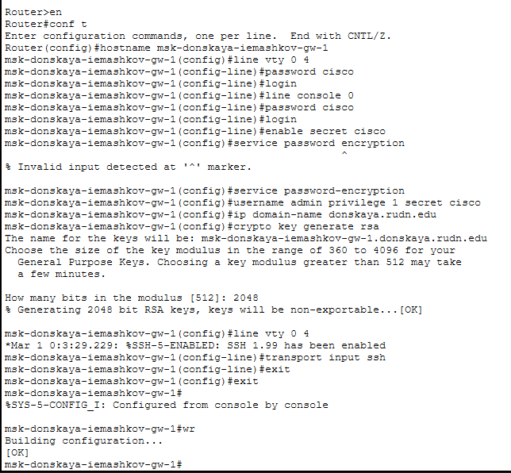
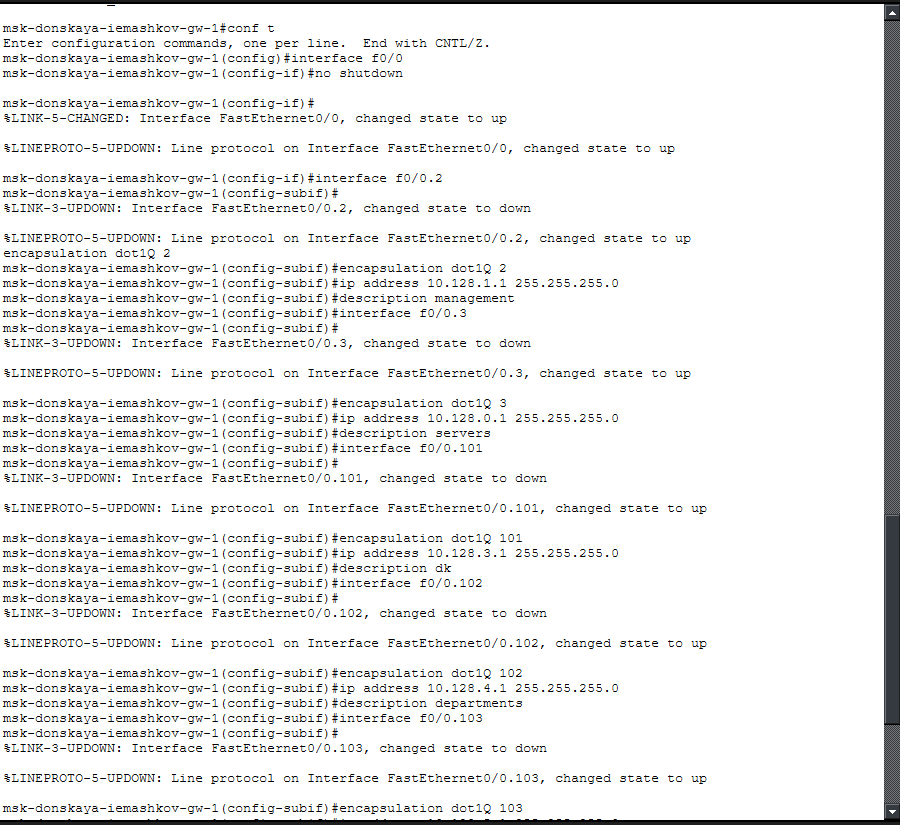
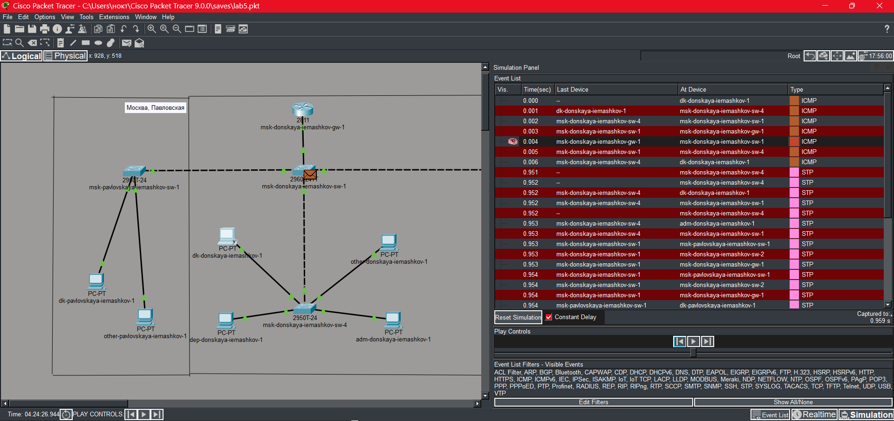
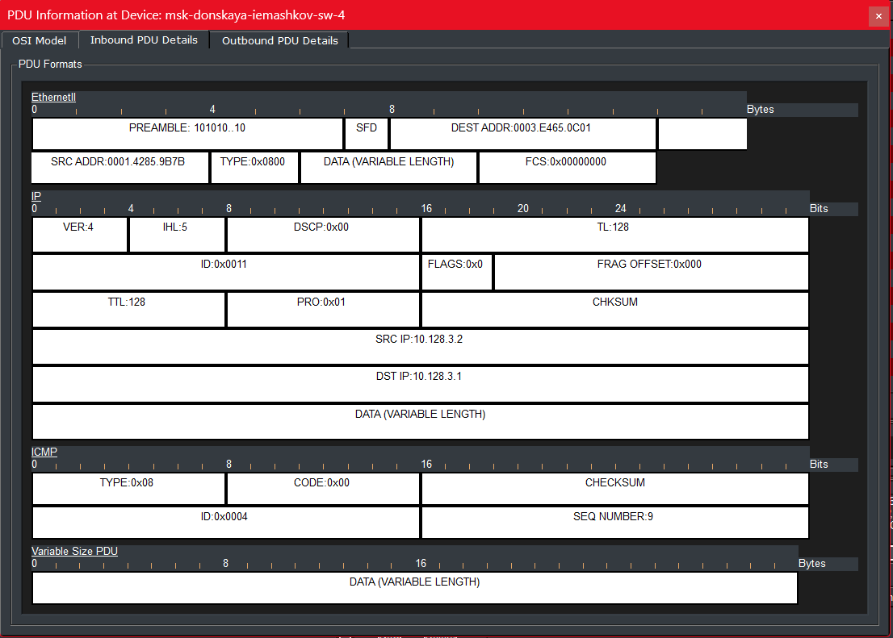

---
## Author
author:
  name: Машков Илья Евгеньевич
  email: 1132231984@yandex.ru
  affiliation:
    - name: Российский университет дружбы народов
      country: Российская Федерация
      postal-code: 117198
      city: Москва
      address: ул. Миклухо-Маклая, д. 6

## Title
title: "Лабораторная работа №6"
subtitle: "Администрирование локальных сетей"
license: "CC BY"
---

# Цель работы

Настроить статическую маршрутизацию VLAN в сети.

# Задание

1. Добавить в локальную сеть маршрутизатор, провести его первоначальную настройку.
2. Настроить статическую маршрутизацию VLAN.
3. При выполнении работы необходимо учитывать соглашение об именовании.

# Выполнение лабораторной работы

В логическую область нашей схемы добавляю маршрутизатор Cisco 2811 и задаю название msk-donskaya-iemashkov-gw-1, а затем приступаю к первоначальной настройке, которую мы уже проводили и в прошлых лабораторных работах ([рис. @fig-001]).

{#fig-001 width=70%}

На коммутаторе msk-donskaya-iemashkov-sw-1 переводим порт f0/24 в режим транка ([рис. @fig-002]).

{#fig-002 width=70%}

На интерфейсе f0/0 нашего маршрутизатора настраиваю виртуальные порты для каждого vlan и прописываю соответствующие этим номерам ip адреса([рис. @fig-003]). 

{#fig-003 width=70%}

Затем проверяю доступность оконечных устройств из разных vlan ([рис. @fig-004]). Как видно по скриншоту доступность подтверждена.  

{#fig-004 width=70%}

Запускаем режим симуляции и наблюдаем за передвижением пакетов. Заметно, что ICMP-пакет движется чётко по иаршруту от ПК до маршрутизатора и обратно, без репликаций пакета ([рис. @fig-005]). 

{#fig-005 width=70%}

Просматриваем содержимое данного пакета и видим mac-адреса отправителя и получателя, в IP видим те же адреса, в секции ICMP видим код 0x08, что является эхо запросом ([рис. @fig-006])

{#fig-006 width=70%}

# Выводы

В процессе выполнения данной лабораторной работы я получил навыки по настройке статической маршрутизации vlan в сети.

