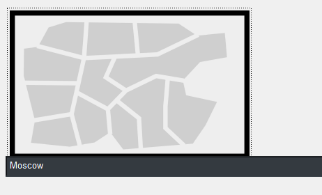
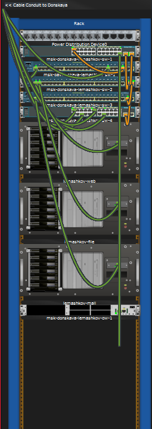
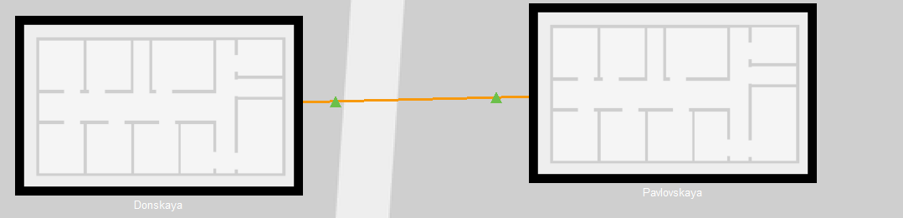
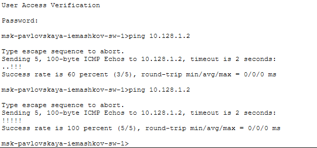
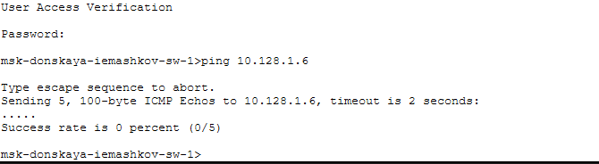
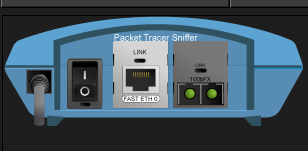
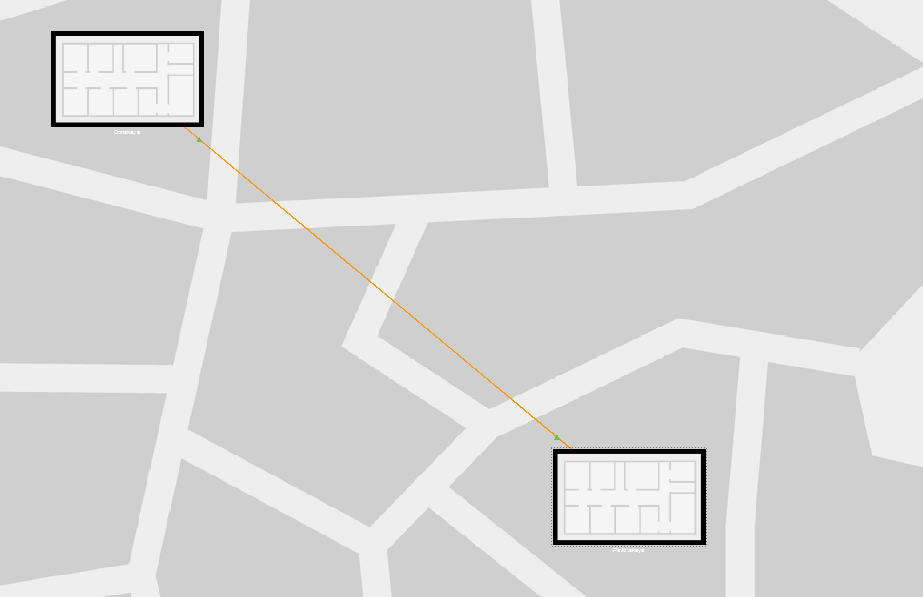
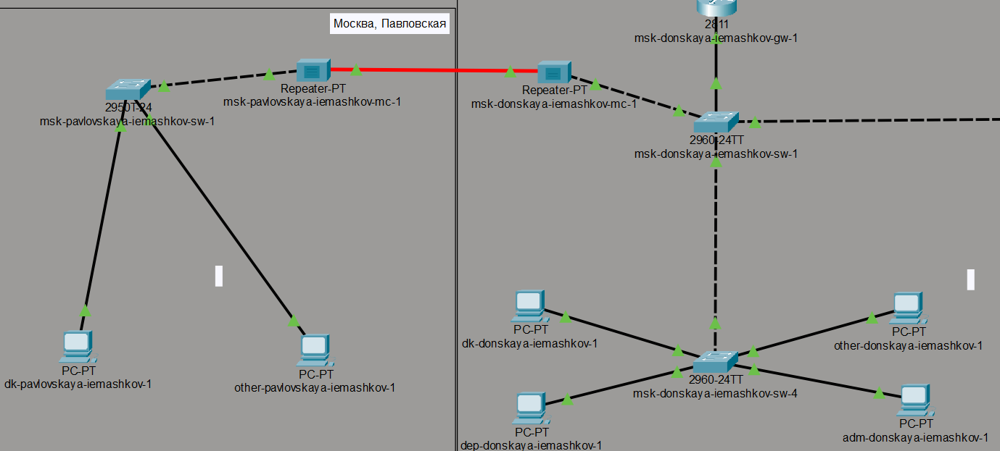
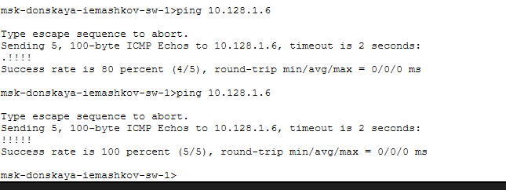

---
## Author
author:
  name: Машков Илья Евгеньевич
  email: 1132231984@yandex.ru
  affiliation:
    - name: Российский университет дружбы народов
      country: Российская Федерация
      postal-code: 117198
      city: Москва
      address: ул. Миклухо-Маклая, д. 6

## Title
title: "Лабораторная работа №7"
subtitle: "Администрирование локальных сетей"
license: "CC BY"
---

# Цель работы

Получить навыки работы с физической рабочей областью Packet Tracer, а также учесть физические параметры сети.

# Задание

Требуется заменить соединение между коммутаторами двух территорий msk-donskaya-sw-1 и msk-pavlovskaya-sw-1 на соединение, учитывающее физические параметры сети, а именно — расстояние между двумя территориями.

# Выполнение лабораторной работы

Перехожу к моей топологии, которую мы дополнили маршрутизатором в 6-ой лабораторной ([рис. @fig-001]).

{#fig-001 width=70%}

Затем перехожу в физическую рабочую область и даю название городу ([рис. @fig-002]).

{#fig-002 width=70%}

Захожу в город и там даю название зданию ([рис. @fig-003]).

{#fig-003 width=70%}

В изображении здания вижу серверную и устройства, которые к ней подключены ([рис. @fig-004]).

{#fig-004 width=70%}

В изображении серверной мы видим все наши коммутаторы и сервера ([рис. @fig-005]).

{#fig-005 width=70%}

Нам необходимо перенести коммутатор и два ПК, относящихся к нему, в заранее созданное здание Pavlovskaya, т.к. они принадлежат именно этой области. Для этого используем опцию move ([рис. @fig-006]).

{#fig-006 width=70%}

Видим, что перенос удачный и всё работает ([рис. @fig-007]).

{#fig-007 width=70%}

Затем с коммутатора msk-pavlovskaya-iemashkov-sw-1 отправляю эхо-запросы на коммутатор msk-donskaya-iemashkov-sw-1. Видим, что соединение есть и работает исправно ([рис. @fig-008]).

{#fig-008 width=70%}

Затем активирую разрешение на учёт физических характеристик среды передачи ([рис. @fig-009]).

{#fig-009 width=70%}

Делаем повторную попытку отправки эхо-запросов при новых обстоятельствах. Видим, что пакеты не дошли, т.к. расстояние между коммутаторами превышало допустимые значения (>100м) ([рис. @fig-010]).

{#fig-010 width=70%}

Затем удаляем соединение между sw-1 в Павловской и sw-1 в Донской. Добавляем повторители msk-donskaya-iemashkov-mc-1 и msk-pavlovskaya-iemashkov-mc-1, заменяя модули на на PT-REPEATER-NM-1FFE и PT-REPEATER-NM-1CFE для подключения оптоволокна и витой пары по технологии Fast Ethernet ([рис. @fig-011]).

{#fig-011 width=70%}

Подключаем повторители к комутаторам по витой паре, а сами повторители соединяем между собой оптоволокном. Затем в физической среде мы можем отодвинуть здания друг от друга на любое расстояние ([рис. @fig-012]).

{#fig-012 width=70%}

Логический вид схемы выглядит так ([рис. @fig-013]).

{#fig-013 width=70%}

Проверяем работоспособность соединения эхо-запросами с тех же коммутаторов. Видим, что всё отлично работает ([рис. @fig-014]).

{#fig-014 width=70%}

# Выводы

В ходе данной лабораторной работы мной были получены навыки работы с физической рабочей областью Packet Tracer, а также учтены физические параметры сети.

# Список литературы{.unnumbered}

1.  **802.1D-2004 - IEEE Standard for Local and Metropolitan Area Networks. Media Access Control (MAC) Bridges** : тех. отч. / IEEE. — 2004. — С. 1—277. — DOI: 10.1109/IEEESTD.2004.94569. — URL: http://ieeexplore.ieee.org/servlet/opac?punumber=9155.
2.  **802.1Q - Virtual LANs**. — URL: http://www.ieee802.org/1/pages/802.1Q.html.
3.  **A J. Packet Tracer Network Simulator**. — Packt Publishing, 2014. — ISBN 9781782170426. — URL: https://books.google.com/books?id=eVOcAgAAQBAJ&dq=cisco+packet+tracer&hl=es&source=gbs_navlinks_s.
4.  **Cotton M., Vegoda L. Special Use IPv4 Addresses** : RFC / RFC Editor. — 01.2010. — С. 1—11. — № 5735. — DOI: 10.17487/rfc5735. — URL: https://www.rfc-editor.org/info/rfc5735.
5.  **Droms R. Dynamic Host Configuration Protocol** : RFC / RFC Editor. — 03.1997. — С. 1—45. — № 2136. — DOI: 10.17487/rfc2131. — URL: https://www.ietf.org/rfc/rfc2131.txt%20https://www.rfc-editor.org/info/rfc2131.
6.  **McPherson D., Dykes B. VLAN Aggregation for Efficient IP Address Allocation**, RFC 3069. — 2001. — URL: http://www.ietf.org/rfc/rfc3069.txt.
7.  **Moy J. OSPF Version 2** : RFC / RFC Editor. — 1998. — С. 244. — DOI: 10.17487/rfc2328. — URL: https://www.rfc-editor.org/info/rfc2328.
8.  **NAT Order of Operation**. — URL: https://www.cisco.com/c/en/us/support/docs/ip/network-address-translation-nat/6209-5.html.
9.  **NAT: вопросы и ответы** / Сайт поддержки продуктов и технологий компании Cisco. — URL: https://www.cisco.com/cisco/web/support/RU/9/92/92029_nat-faq.html.
10. **Neumann J. C. Cisco Routers for the Small Business A Practical Guide for IT Professionals**. — Apress, 2009.
11. **Odom S., Nottingham H. Cisco Switching: Black Book**. — The Coriolis Group, 2001. — ISBN 9781576107065. — URL: http://books.google.sk/books?id=GYsLAAAACAAJ.
12. **Tetz E. Cisco Networking All-in-One For Dummies**. — Indianapolis, Indiana : John Wiley & Sons, Inc., 2011. — (For Dummies). — URL: http://www.dummies.com/store/product/Cisco-Networking-All-in-One-For-Dummies.productCd-0470945583.html.
13. **ГОСТ Р ИСО/МЭК 7498-1-99**. — «ВОС. Базовая эталонная модель. Часть 1. Базовая модель». — ОКС: 35.100.70. — Действует c 01.01.2000. — URL: http://protect.gost.ru/v.aspx?control=7&id=132355.
14. **Кларк К., Гамильтон К. Принципы коммутации в локальных сетях Cisco**. — М. : Вильямс, 2003. — (Cisco Press Core Series). — ISBN 5-8459-0464-1.
15. **Королькова А. В., Кулябов Д. С. Архитектура и принципы построения современных сетей и систем телекоммуникаций**. — М. : Издательство РУДН, 2009.
16. **Королькова А. В., Кулябов Д. С. Прикладные протоколы Интернет и www. Курс лекций**. — М. : РУДН, 2012. — ISBN 9785209049500.
17. **Королькова А. В., Кулябов Д. С. Прикладные протоколы Интернет и www. Лабораторные работы**. — М. : РУДН, 2012. — ISBN 9785209049357.
18. **Королькова А. В., Кулябов Д. С. Сетевые технологии. Лабораторные работы**. — М. : РУДН, 2014. — ISBN 785209056065.
19. **Куроуз Д. Ф., Росс К. В. Компьютерные сети. Нисходящий подход**. — 6-е изд. — М. : Издательство «Э», 2016. — (Мировой компьютерный бестселлер).
20. **Одом У. Официальное руководство Cisco по подготовке к сертификационным экзаменам CCENT/CCNA ICND1 100-101**. — М. : Вильямс, 2017. — (Cisco Press Core Series). — ISBN 978-5-8459-1906-9.
21. **Одом У. Официальное руководство Cisco по подготовке к сертификационным экзаменам CCNA ICND2 200-101. Маршрутизация и коммутация**. — М. : Вильямс, 2016. — (Cisco Press Core Series).
22. **Олифер В. Г., Олифер Н. А. Компьютерные сети. Принципы, технологии, протоколы**. — 5-е изд. — Питер : Питер, 2017. — (Учебник для вузов). — ISBN 978-5-496-01967-5.
23. **Сети и системы передачи информации: телекоммуникационные сети** / К. Е. Самуйлов [и др.]. — М. : Изд-во Юрайт, 2016. — ISBN 978-5-9916-7198-9.
24. **Таненбаум Э., Уэзеролл Д. Компьютерные сети**. — 5 изд. — Питер : Питер, 2016. — (Классика Computer Science). — ISBN 978-5-496-00831-0.
25. **Хилл Б. Полный справочник по Cisco**. — М. : Вильямс, 2009. — ISBN 978-5-8459-1309-
26. **Цикл статей «Сети для самых маленьких»**. — URL: http://linkmeup.ru/blog/11.html.
27. **Часто задаваемые вопросы технологии NAT** / Сайт поддержки продуктов и технологий компании Cisco. — URL: https://www.cisco.com/c/ru_ru/support/docs/ip/network-address-translation-nat/26704-nat-faq00.html.
