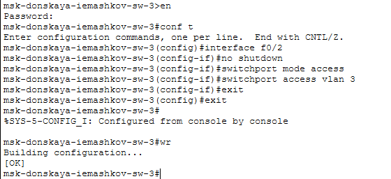
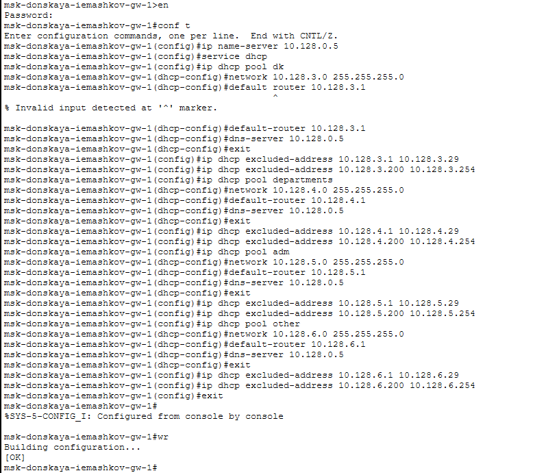

---
## Author
author:
  name: Машков Илья Евгеньевич
  email: 1132231984@yandex.ru
  affiliation:
    - name: Российский университет дружбы народов
      country: Российская Федерация
      postal-code: 117198
      city: Москва
      address: ул. Миклухо-Маклая, д. 6
## Title
title: Лабораторная работа №8
subtitle: Администрирование локальных сетей
license: CC BY
date: 2026-04-04
date-format: "YYYY-MM-DD" 
---

## Цель работы

Приобретение практических навыков по настройке динамического распределения IP-адресов посредством протокола DHCP в локальной сети.

## Выполнение лабораторной работы

{#fig-001 width=70%}

## Выполнение лабораторной работы

{#fig-002 width=70%}

## Выполнение лабораторной работы

{#fig-003 width=70%}

## Выполнение лабораторной работы

{#fig-004 width=70%}

## Выполнение лабораторной работы

{#fig-005 width=70%}

## Выполнение лабораторной работы

{#fig-006 width=70%}

## Выполнение лабораторной работы

{#fig-007 width=70%}

## Выполнение лабораторной работы

{#fig-008 width=70%}

## Выполнение лабораторной работы

{#fig-009 width=70%}

## Выполнение лабораторной работы

{#fig-010 width=70%}

## Выводы

В процессе выполнения этой лабораторной работы я приобрёл практические навыки по настройке динамического распределения IP-адресов посредством протокола DHCP в локальной сети.
