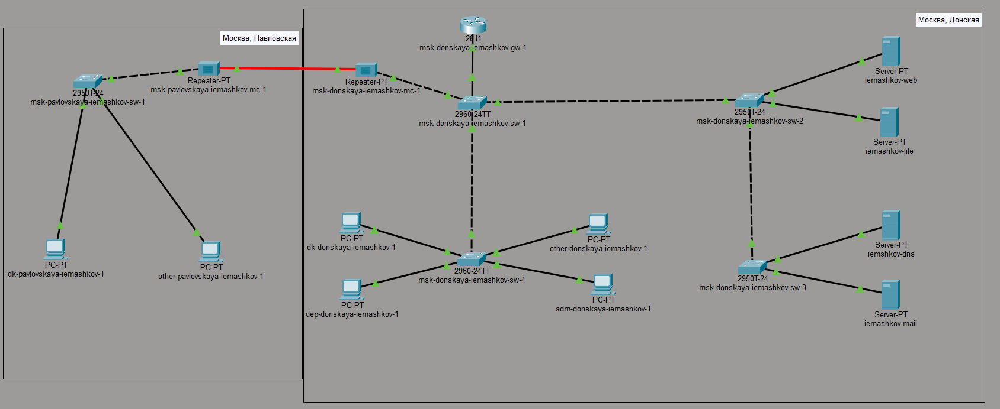
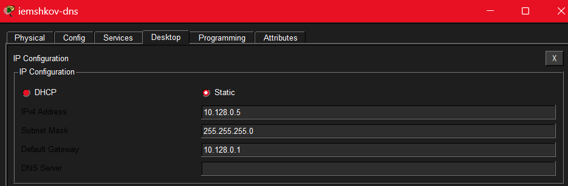
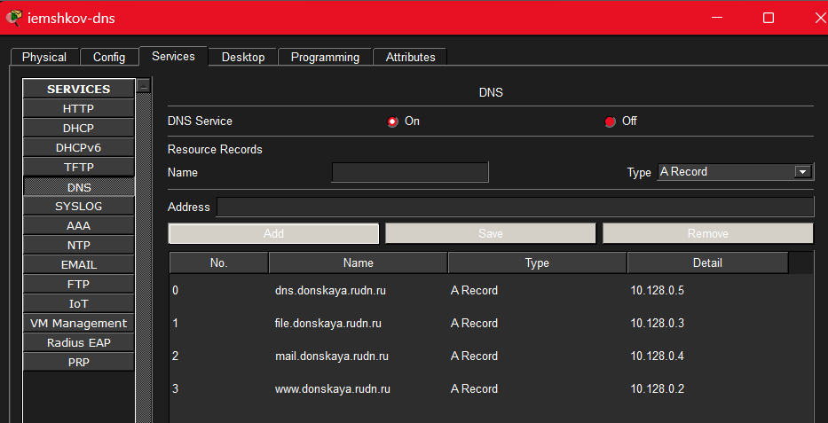
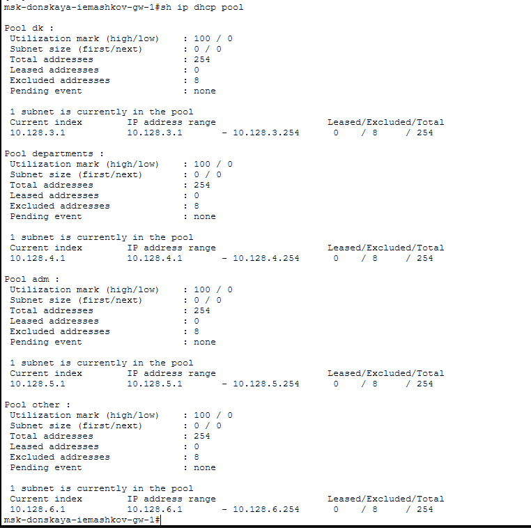
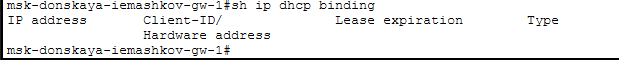
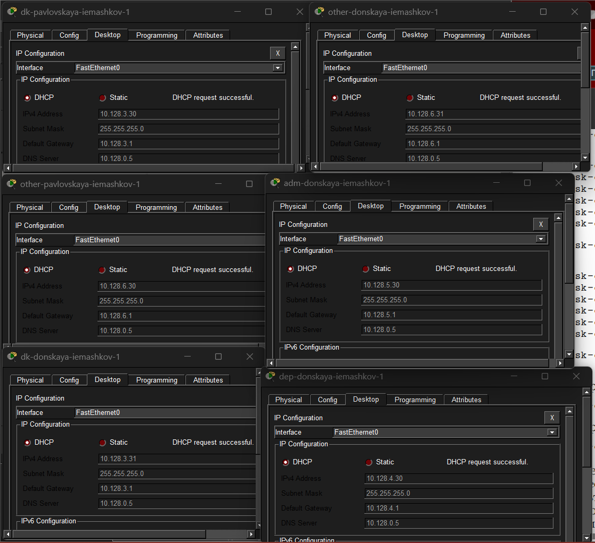
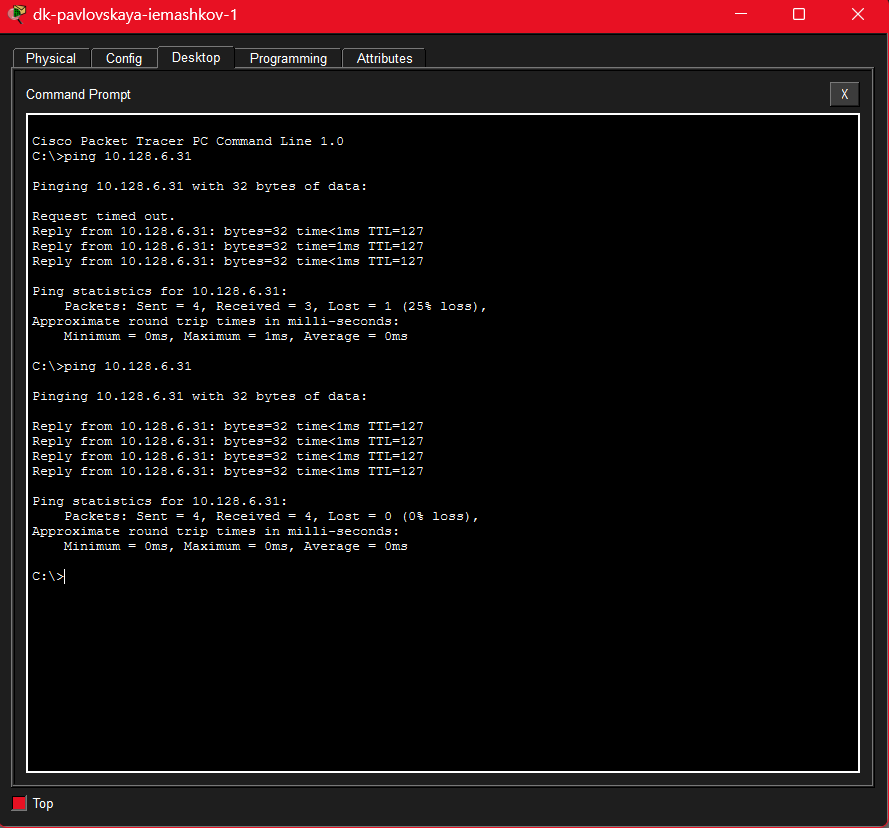
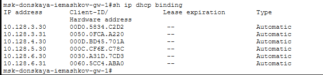

---
## Author
author:
  name: Машков Илья Евгеньевич
  email: 1132231984@yandex.ru
  affiliation:
    - name: Российский университет дружбы народов
      country: Российская Федерация
      postal-code: 117198
      city: Москва
      address: ул. Миклухо-Маклая, д. 6

## Title
title: "Лабораторная работа №8"
subtitle: "Администрирование локальных сетей"
license: "CC BY"
---

# Цель работы

Приобретение практических навыков по настройке динамического распределения IP-адресов посредством протокола DHCP в локальной сети.

# Задание

1. Добавить DNS-записи для домена donskaya.rudn.ru на сервер dns.
2. Настроить DHCP-сервис на маршрутизаторе.
3. Заменить в конфигурации оконечных устройствах статическое распределение адресов на динамическое.
4. При выполнении работы необходимо учитывать соглашение об именовании

# Выполнение лабораторной работы

В логическую рабочую область нашего проекта добавляю PT-Server с названием iemashkov-dns ([рис. @fig-001]).

{#fig-001 width=70%}

В конфигурации сервера меняю его IPv4-адрес на 10.128.0.5, шлюз на 10.128.0.1, а маску на 255.255.255.0 ([рис. @fig-002]).

{#fig-002 width=70%}

Затем конфигурирую порт f0/2 коммутатора msk-donskaya-iemashkov-sw-3 ([рис. @fig-003]).

{#fig-003 width=70%}

Потом в конфигурации dns-сервера добавляю четыре A-записи для серверов web, mail, file, dns с соответствующими адресами ([рис. @fig-004]).

{#fig-004 width=70%}

Настраиваю DHCP-сервис на маршрутизаторе msk-donskaya-iemashkov-gw-1. Задаю IP-адрес DNS-сервера для роутера, название для каждого диапазона адресов, адрес сети, адрес шлюза, диапазон исключаемых адресов и адрес DNS-сервера для каждой выделенной сети ([рис. @fig-005]).

{#fig-005 width=70%}

Потом просматриваю информацию о диапазонах, которые я настроил, и вижу там всё то, что и должно быть ([рис. @fig-006]).

{#fig-006 width=70%}

Также просматриваем информацию о привязке выданных адресов. Видим, что пока что там ничего нет, т.к. мы не настраивали наши оконечные устройства ([рис. @fig-007]).

{#fig-007 width=70%}

На всех 6-ти компьютерах меняем статическое распределение адресов на динамическое и видим, что все устройства получили адреса, начиная с .30 ([рис. @fig-008]).

{#fig-008 width=70%}

С dk-pavlovskaya-iemashkov-1 отправляю эхо-запросы на other-donskaya-iemashkov-1. Видим, что они дошли.([рис. @fig-009]). Из этого делаем вывод, что все устройства у нас связаны (потом я пинговал и другие ПК с этого же dk в Павловской).

{#fig-009 width=70%}

Затем снова просматриваем информацию о привязках. Видим, что все 6 адресов появились в этом списке ([рис. @fig-010]).

{#fig-010 width=70%}

# Выводы

В процессе выполнения этой лабораторной работы я приобрёл практические навыки по настройке динамического распределения IP-адресов посредством протокола DHCP в локальной сети.

