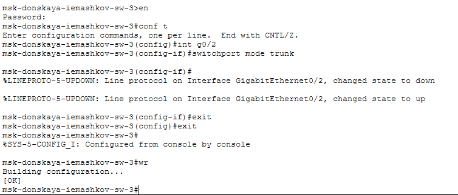
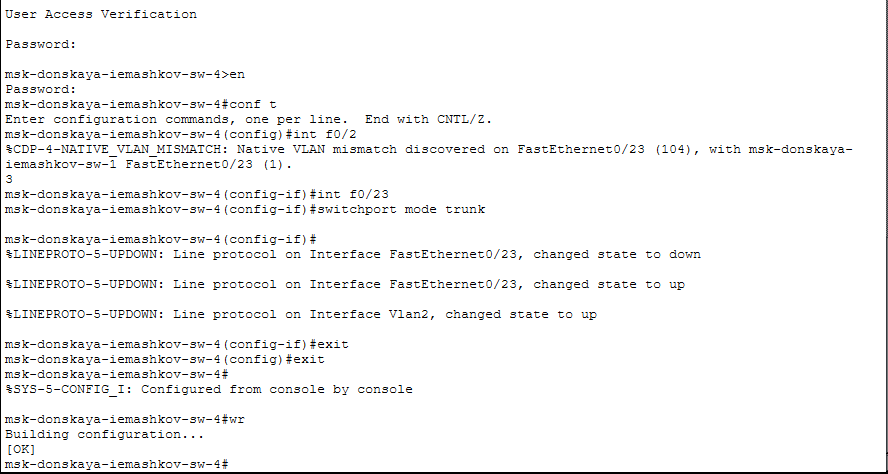
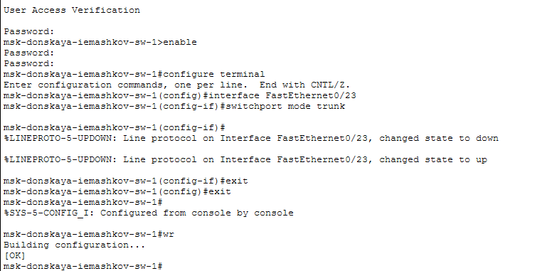
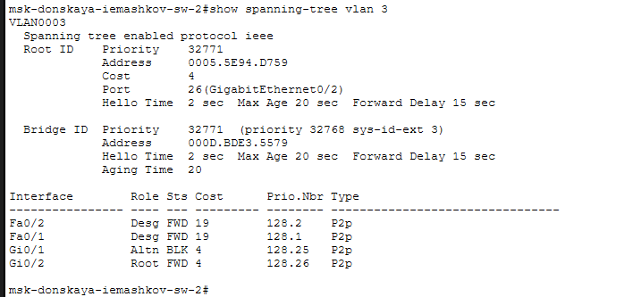
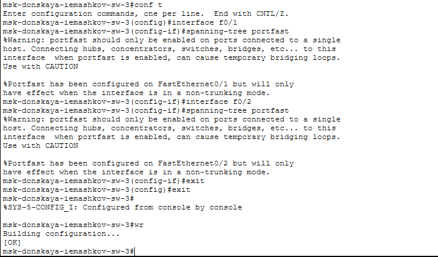
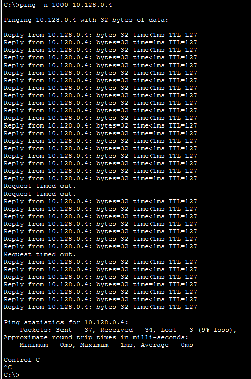
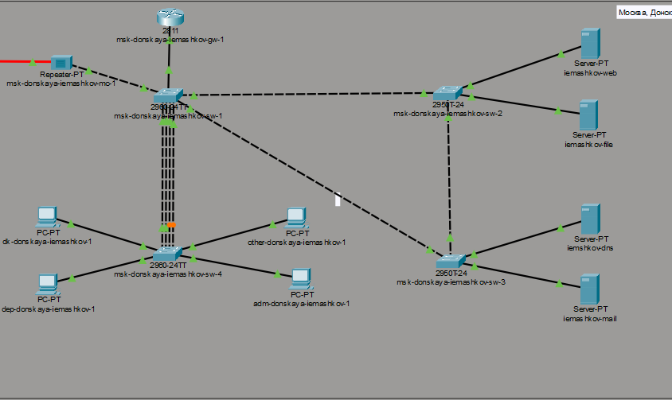
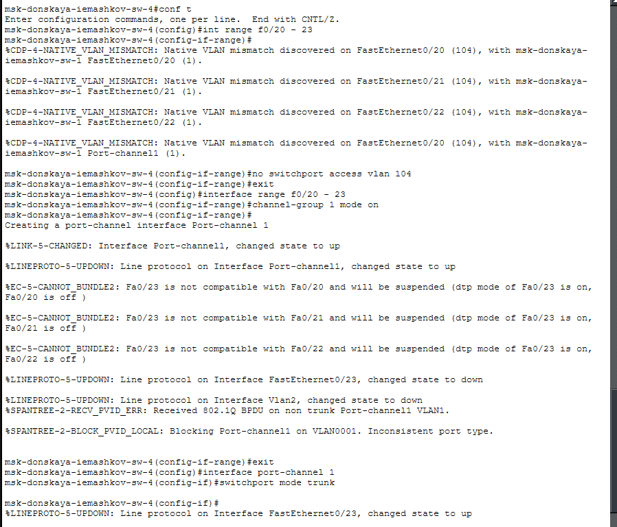

---
## Author
author:
  name: Машков Илья Евгеньевич
  email: 1132231984@yandex.ru
  affiliation:
    - name: Российский университет дружбы народов
      country: Российская Федерация
      postal-code: 117198
      city: Москва
      address: ул. Миклухо-Маклая, д. 6

## Title
title: "Лабораторная работа №9"
subtitle: "Администрирование локальных сетей"
license: "CC BY"
---

# Цель работы

Изучение возможностей протокола STP и его модификаций по обеспечению отказоустойчивости сети, агрегированию интерфейсов и перераспределению нагрузки между ними.

# Задание

1. Сформируйте резервное соединение между коммутаторами msk-donskaya-sw-1 и msk-donskaya-sw-3.
2. Настройте балансировку нагрузки между резервными соединениями.
3. Настройте режим Portfast на тех интерфейсах коммутаторов, к которымподключены серверы.
4. Изучите отказоустойчивость резервного соединения.
5. Сформируйте и настройте агрегированное соединение интерфейсов Fa0/20 – Fa0/23 между коммутаторами msk-donskaya-sw-1 и msk-donskaya-sw-4.
6. При выполнении работы необходимо учитывать соглашение об именовании.

# Выполнение лабораторной работы

Для начала перехожу к нашей топологии и создаю соединение между msk-donskaya-iemashkov-sw-1 и msk-donskaya-iemashkov-sw-3, через порты G0/2 на обоих коммутаторах. А соединение между sw-1 и sw-4 поменял на Fa0/23 ([рис. @fig-001]).

{#fig-001 width=70%}

Далее было необходимо переключить новый порт на sw-3 в транковый режим ([рис. @fig-002]). 

{#fig-002 width=70%}

То же делаю на sw-4, потому что у нас создано соединение, через другой порт (fa0/23) ([рис. @fig-003]). 

{#fig-003 width=70%}

Аналогично sw-4 настраиваем и порт на sw-1 ([рис. @fig-004]).

{#fig-004 width=70%}

Запуск симуляций показал, что пакеты двигались через sw-3, а не через sw-2, как предполагалось. Произошло это потому что соединение между sw-1 и sw-2 было неисправно (порт горел оранжевым) по неизвестным причинам.

На sw-2 проверяем состояние протокола stp. Как мы видим, строчки о том, что это корневое устройство, не наблюдается ([рис. @fig-005]).

Настраиваем sw-1 как корневое устройство для протокола stp ([рис. @fig-006]).

{#fig-006 width=70%}

Затем запускаем симуляцию и видим, что до сервера web пакеты идут через sw-2, а до mail через sw-3, как и должно было быть.

Затем настраиваю режим Portfast на sw-2 ([рис. @fig-007]) и на sw-3 ([рис. @fig-008]).

{#fig-007 width=70%}

{#fig-008 width=70%}

Далее с помощью команды ping -n 1000 10.128.0.4 я проверил отказоустойчивость ([рис. @fig-009]). Т.е. после запуска команды я отключил наше соединение между sw-1 и sw-3 и наблюдал, насколько быстро восстановится соединение, через резервный канал. Соединение воостановилось через 8 запросов, а после включения соединения связь восстановилось через 5 запросов.

{#fig-009 width=70%}

Затем я переключил все коммутаторы на режим работы по протоколу Rapid PVST+ ([рис. @fig-010]). Да, на всех коммутаторах процесс переключения на другой протокол не отличается. 

{#fig-010 width=70%}

Затем снова используем команду ping -n 1000 10.128.0.4 для проверки отказоустойчивости ([рис. @fig-011]). Процесс проверки ровно такой же, как и в прошлый раз. Как видно на скриншоте в первый раз соединение восстановилось, через 2 запроса, а потом через один. Т.е. протокол Rapid PVST+ обеспечивает более быстрое восстановление соединение.

{#fig-011 width=70%}

Затем я настраиваю агрегирование каналов между sw-1 и sw-4 ([рис. @fig-012]). Для начала надо было добавить соединение sw-1 и sw-4 через порты Fa0/20 - Fa0/23

{#fig-012 width=70%}

После создания соединений переходим к настройке агрегации каналов на каждом коммутаторе отдельно ([рис. @fig-013]). На данном скриншоте производится настройка коммутатора sw-1

{#fig-013 width=70%}

А теперь то же самое делаем на sw-4 ([рис. @fig-014]).

{#fig-014 width=70%}

# Выводы

В процессе выполнения данной лабораторной работы я изучил возможности протокола STP и его модификаций по обеспечению отказоустойчивости сети, агрегированию интерфейсов и перераспределению нагрузки между ними.
