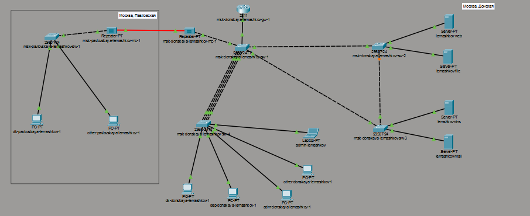
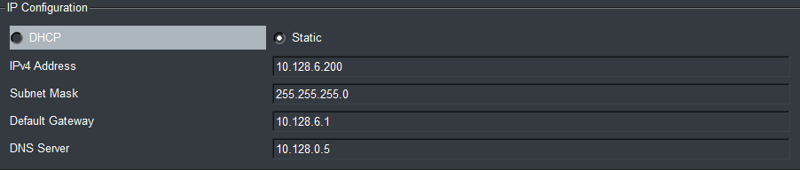
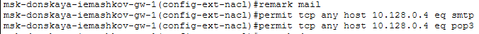
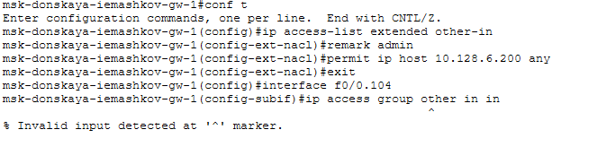
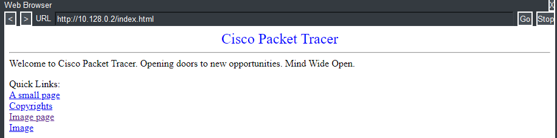
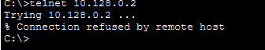
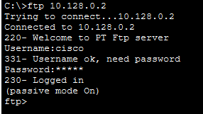
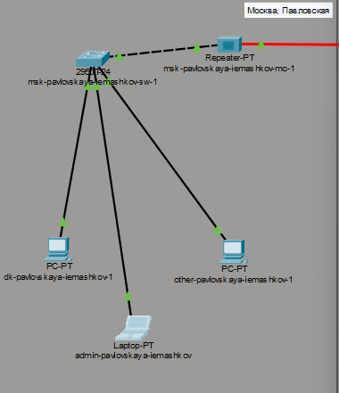
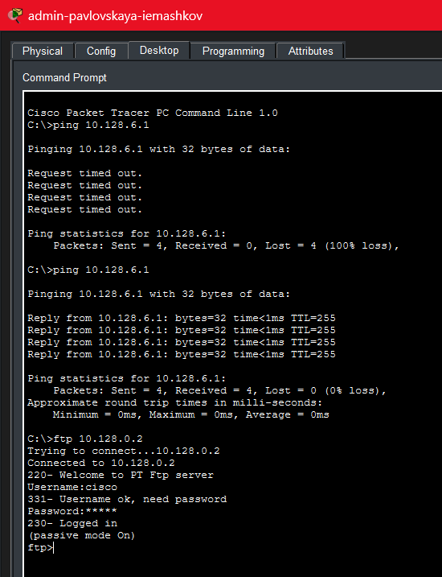

---
## Author
author:
  name: Машков Илья Евгеньевич
  email: 1132231984@yandex.ru
  affiliation:
    - name: Российский университет дружбы народов
      country: Российская Федерация
      postal-code: 117198
      city: Москва
      address: ул. Миклухо-Маклая, д. 6
## Title
title: Лабораторная работа №10
subtitle: Администрирование локальных сетей
license: CC BY
date: 2026-09-01
date-format: "YYYY-MM-DD" 
---

## Цель работы

Освоить настройку прав доступа пользователей к ресурсам сети.

## Выполнение лабораторной работы

{width=50%} 

## Выполнение лабораторной работы

{width=60%}

## Выполнение лабораторной работы

{width=70%}

## Выполнение лабораторной работы

{width=70%}

## Выполнение лабораторной работы

{width=70%}

## Выполнение лабораторной работы

{width=70%}

## Выполнение лабораторной работы

{width=70%}

## Выполнение лабораторной работы

{width=70%}

## Выполнение лабораторной работы

{width=70%}

## Выполнение лабораторной работы

{width=70%}

## Выполнение лабораторной работы

{width=70%}

## Выполнение лабораторной работы

{width=70%}

## Выполнение лабораторной работы

{width=70%}

## Выполнение лабораторной работы

{width=50%}

## Выполнение лабораторной работы

{width=30%}

## Выполнение лабораторной работы

{width=40%}

## Выполнение лабораторной работы

{width=20%}

## Выводы

В процессе выполнения данной лабораторной работы я освоил навыки по настройке прав доступа к ресурсам сети.
