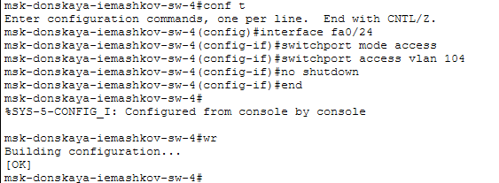
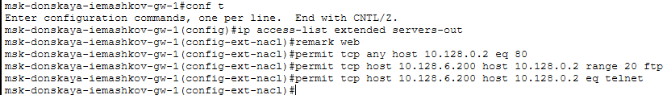
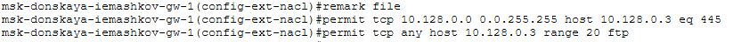
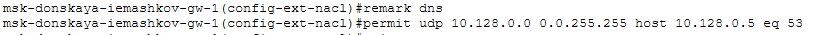
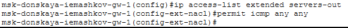
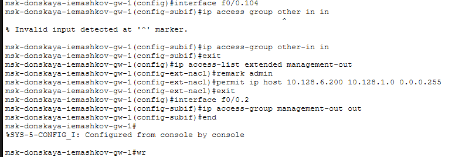
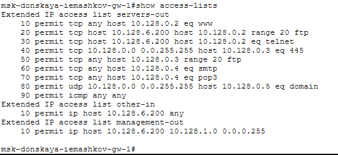
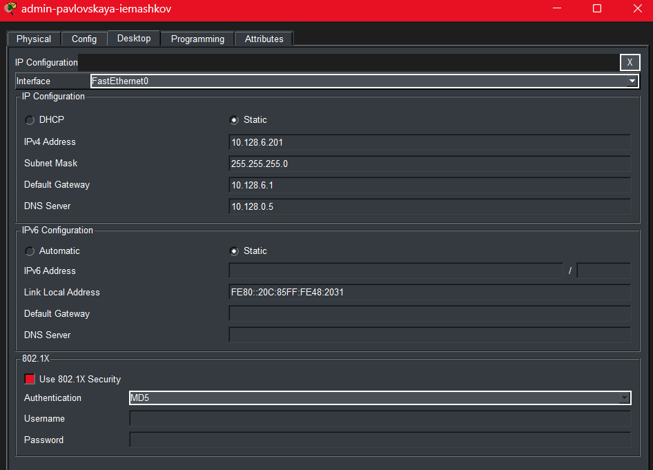
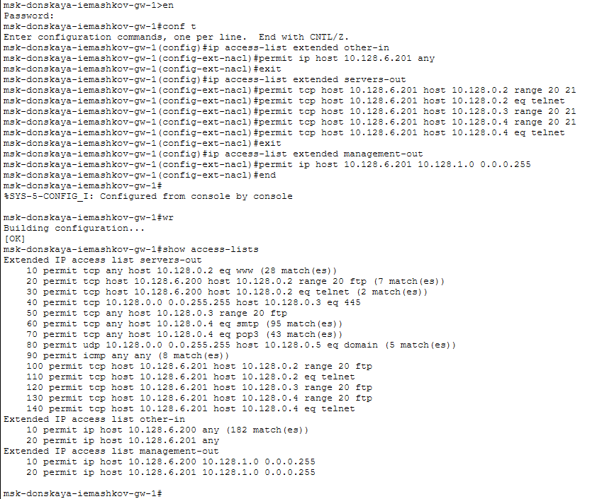

---
## Author
author:
  name: Машков Илья Евгеньевич
  email: 1132231984@yandex.ru
  affiliation:
    - name: Российский университет дружбы народов
      country: Российская Федерация
      postal-code: 117198
      city: Москва
      address: ул. Миклухо-Маклая, д. 6

## Title
title: "Лабораторная работа №10"
subtitle: "Администрирование локальных сетей"
license: "CC BY"
---

# Цель работы

Освоить настройку прав доступа пользователей к ресурсам сети.

# Задание

1. Требуется настроить следующие правила доступа:
1) web-сервер: разрешить доступ всем пользователям по протоколу HTTP через порт 80 протокола TCP, а для администратора открыть доступ по протоколам Telnet и FTP;
2) файловый сервер: с внутренних адресов сети доступ открыт по портам для общедоступных каталогов, с внешних — доступ по протоколу FTP;
3) почтовый сервер: разрешить пользователям работать по протоколам SMTP и POP3 (соответственно через порты 25 и 110 протокола TCP), а для администратора — открыть доступ по протоколам Telnet и FTP;
4) DNS-сервер: открыть порт 53 протокола UDP для доступа из внутренней сети;
5) разрешить icmp-сообщения, направленные в сеть серверов;
6) запретить для сети Other любые запросы за пределы сети, за исключением администратора;
7) разрешить доступ в сеть управления сетевым оборудованием только администратору сети.
2. Требуется проверить правильность действия установленных правил доступа.
3. Требуется выполнить задание для самостоятельной работы по настройке прав доступа администратора сети на Павловской.
4. При выполнении работы необходимо учитывать соглашение об именовании).

# Выполнение лабораторной работы

В рабочей области проекта подключаю ноутбук администратора к сети к other-donskaya-iemashkov-1 ([рис. @fig-001]). Для этого я присоединил его к 24-му порту коммутатора sw-4 ([рис. @fig-002]).

{#fig-001 width=70%} 

{#fig-002 width=70%}

Выдаю ноутбуку адрес 10.128.6.200, gateaway-адрес 10.128.6.1 и адрес dns-сервера 10.128.0.5 ([рис. @fig-003]). 

{#fig-003 width=70%}

На маршрутизаторе gw-1 настраиваю доступ к web-серверу по порту tcp 80 ([рис. @fig-004]). Был создан список контроля доступа с названием servers-out; указано, что ограничения предназначены для работы с web-сервером; дано разрешение доступа (permit) по протоколу TCP всем (any) пользователям сети (host) на доступ к web-серверу, имеющему адрес 10.128.0.2, через порт 80. Также мы подключили список прав доступа servers-out к f0/0.3 и применяется к исходящему трафику. Настроил доступ администратора по протоколам telnet и ftp.

{#fig-004 width=70%}

Затем настроил доступ к файловому серверу ([рис. @fig-005]). Т.е. в списке контроля доступа servers-out указано (в качестве комментария-напоминания remark file), что следующие ограничения предназначены для работы с file-сервером; всем узлам внутренней сети (10.128.0.0) разрешён доступ по протоколу SMB (работает через порт 445 протокола TCP) к каталогам общего пользования; любым узлам разрешён доступ к file-серверу по протоколу FTP. Запись 0.0.255.255 — обратная маска.

{#fig-005 width=70%}

Теперь настраиваем доступ к почтовому серверу ([рис. @fig-006]). Т.е. всем разрешён доступ к почтовому серверу по протоколам POP3 и SMTP.

{#fig-006 width=70%}

Настраиваю доступ к DNS-серверу ([рис. @fig-007]). Т.е. всем узлам внутренней сети разрешён доступ к dns-серверу через UDP-порт 53.

{#fig-007 width=70%}

Следующими строками разрешаю icmp-запросы ([рис. @fig-008]). Т.е. здесь мы настраииваем явное управление порядком размещения правил.

{#fig-008 width=70%}

Теперь настраиваю доступа для сети other ([рис. @fig-010]). Т.е. мы даём все те разрешения для администратора сети с адресом 10.128.6.200

{#fig-010 width=70%}

Настраиваю доступ администратора к сети сетевого оборудования ([рис. @fig-011]). Т.е. администратору был разрешён доступ к сети сетевого оборудования, к интерфейсу f0/0.2 подключается список прав доступа management-out и применяется к исходящему трафику.

{#fig-011 width=70%}

Затем проверяю список контроля доступа и номера строк в нём ([рис. @fig-012]).

{#fig-012 width=70%}

Теперь проверяю настроенные мной права. Начал с проверки доступа к web-серверу ([рис. @fig-013]).

{#fig-013 width=70%}

Доступ по telnet проверку не прошёл ([рис. @fig-014]).

{#fig-014 width=70%}

Через ftp доступ прошёл ([рис. @fig-015]).

{#fig-015 width=70%}

Теперь добавляю такой же ноутбук в зону Павловской ([рис. @fig-017]). IP-адрес 10.128.6.201.

{#fig-017 width=70%}

В рабочей области подключение выглядит следующим образом ([рис. @fig-018]).

{#fig-018 width=70%}

Затем я произвожу те же настройки для админа в Павловской, что и для админа в Донской ([рис. @fig-019]).

{#fig-019 width=70%}

А теперь проверяю правильность выполненных мной настроек ([рис. @fig-020]).

{#fig-020 width=70%}

# Выводы

В процессе выполнения данной лабораторной работы я освоил навыки по настройке прав доступа к ресурсам сети.
