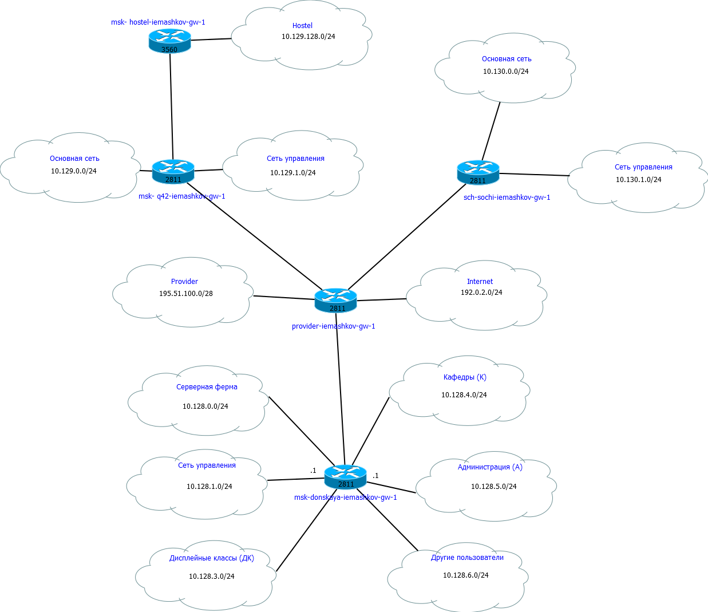
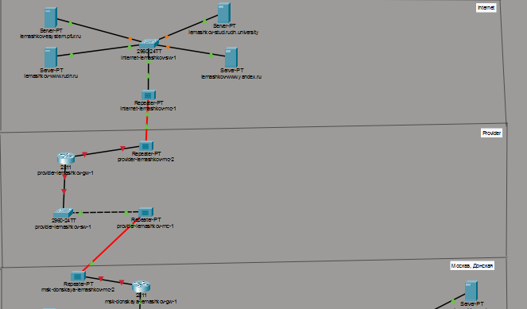
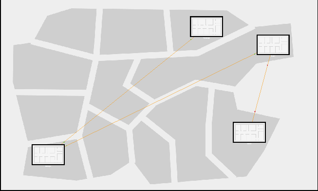
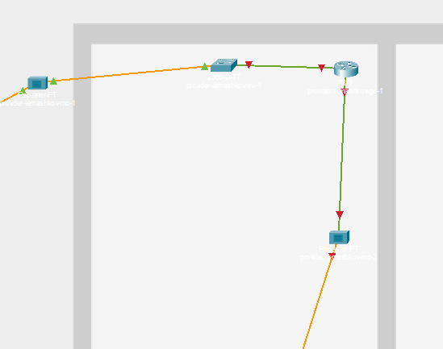
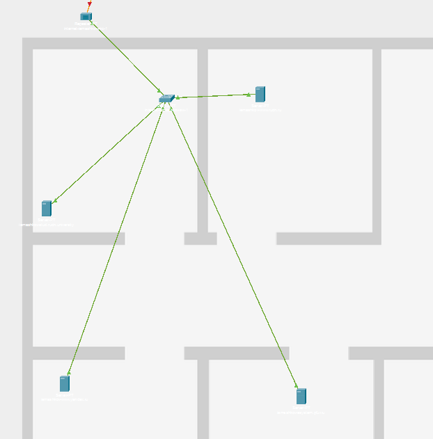
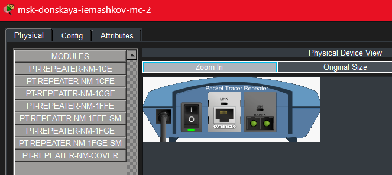
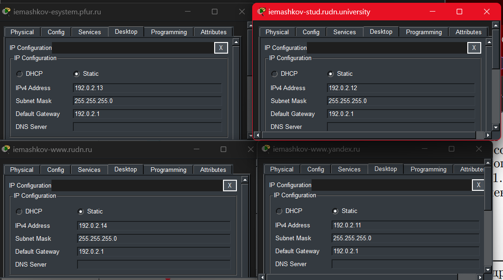

---
## Author
author:
  name: Машков Илья Евгеньевич
  email: 1132231984@yandex.ru
  affiliation:
    - name: Российский университет дружбы народов
      country: Российская Федерация
      postal-code: 117198
      city: Москва
      address: ул. Миклухо-Маклая, д. 6

## Title
title: "Лабораторная работа №11"
subtitle: "Администрирование локальных сетей"
license: "CC BY"
---

# Цель работы

Провести подготовительные мероприятия по подключению локальной сети организации к Интернету.

# Задание

1. Построить схему подсоединения локальной сети к Интернету.
2. Построить модельные сети провайдера и сети Интернет.
3. Построить схемы сетей L1, L2, L3.
4. При выполнении работы необходимо учитывать соглашение об именовании.

# Выполнение лабораторной работы

Для начала вношу изменения в L1-схему сети (т.к. у меня не осталось той версии скриншота я прикрепляю схему из 13-ой лабы) ([рис. @fig-001]).

{#fig-001 width=70%}

Затем вношу изменения в L2 ([рис. @fig-002]) и L3 ([рис. @fig-003]) схемы сетей.

{#fig-002 width=70%} 

{#fig-003 width=70%}

Затем перехожу в рабочую область нашего проекта и добавляю все устройства согласно лабораторной работе (4 репитера, 2 коммутатора 2960-24TT, маршрутизатор 2811 и 4 сервера) ([рис. @fig-004]).

{#fig-004 width=70%}

В физической области добавляем здание Провайдера и здание с серверами интернета ([рис. @fig-005]).

{#fig-005 width=70%}

Расположение устройств в здании провайдера ([рис. @fig-006]).

{#fig-006 width=70%}

Расположение всех устройств в здании с серверами интернета ([рис. @fig-007]).

{#fig-007 width=70%}

На репитерах меняем модули на NM-1FFE и NM-1CFE для подключения витой пары и оптоволокна соответственно ([рис. @fig-008]).

{#fig-008 width=70%}

Всем серверам в области интернета выдаём адреса 192.0.2.11-.14 ([рис. @fig-009]).

{#fig-009 width=70%}

На DNS-сервере добавляем записи наших серверов из области интернета ([рис. @fig-010]).

{#fig-010 width=70%}

# Выводы

Во время выполнения данной лабораторной работы я освоил навыки планирования сети для настройки NAT.
