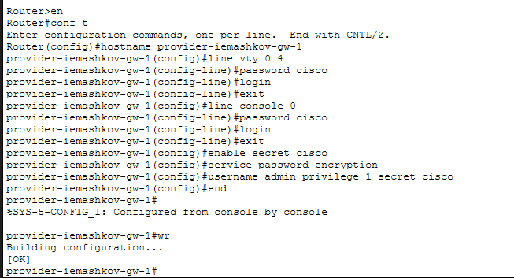
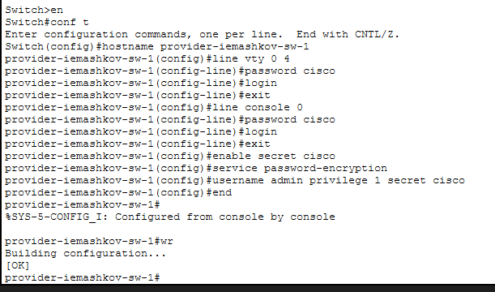
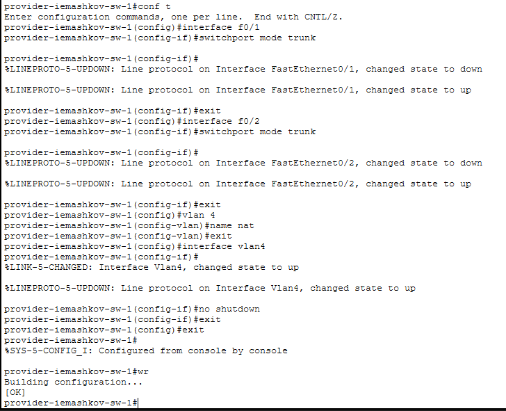
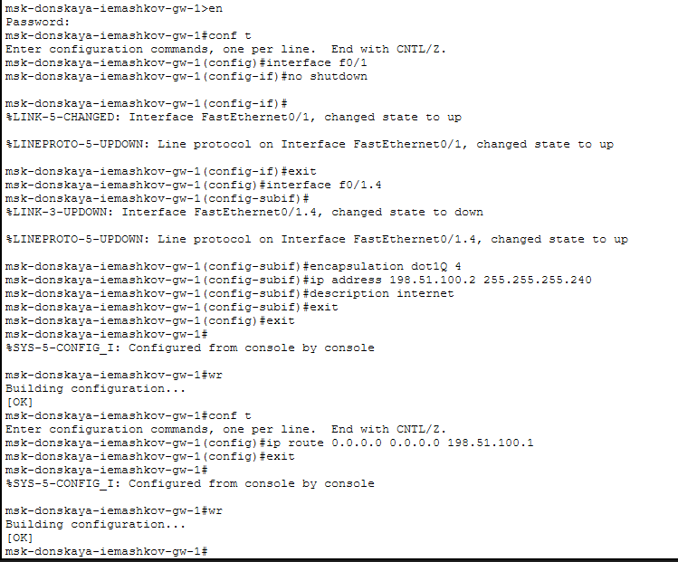
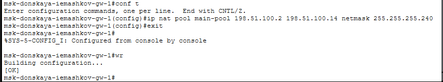
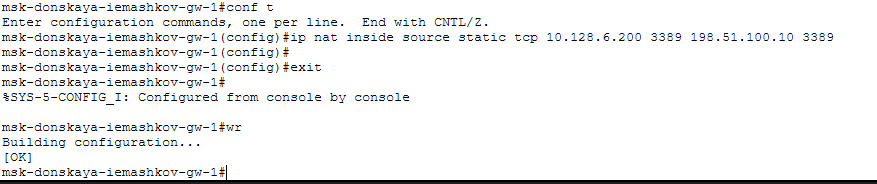

---
## Author
author:
  name: Машков Илья Евгеньевич
  email: 1132231984@yandex.ru
  affiliation:
    - name: Российский университет дружбы народов
      country: Российская Федерация
      postal-code: 117198
      city: Москва
      address: ул. Миклухо-Маклая, д. 6

## Title
title: "Лабораторная работа №12"
subtitle: "Администрирование локальных сетей"
license: "CC BY"
---

# Цель работы

Приобретение практических навыков по настройке доступа локальной сети к внешней сети посредством NAT.

# Задание

1. Сделать первоначальную настройку маршрутизатора provider-gw-1 и коммутатора provider-sw-1 провайдера: задать имя, настроить доступ по паролю и т.п..
2. Настроить интерфейсы маршрутизатора provider-gw-1 и коммутатора provider-sw-1 провайдера.
3. Настроить интерфейсы маршрутизатора сети «Донская» для доступа к сети провайдера.
4. Настроить на маршрутизаторе сети «Донская» NAT с правилами.
5. Настроить доступ из внешней сети в локальную сеть организации.
6. Проверить работоспособность заданных настроек.
7. При выполнении работы необходимо учитывать соглашение об именовании.

# Выполнение лабораторной работы

Произвожу начальную настройку маршрутизатора provider-iemashkov-gw-1 ([рис. @fig-001]) и коммутатора provider-iemashkov-sw-1 ([рис. @fig-002]). Задаю им имя и настраиваю доступ по паролю и т.д.

{#fig-001 width=70%} 

{#fig-002 width=70%}

Затем перехожу к настройке интерфейсов и выдаче адресов на маршрутизаторе gw-1 ([рис. @fig-003]). 

{#fig-003 width=70%}

Также настраиваю интерфейсы коммутатора provider-iemashkov-sw-1 ([рис. @fig-004]). Перевожу их в транковый режим и настраиваю соответствующий vlan для них.

{#fig-004 width=70%}

Теперь настраиваю интерфейсы на маршрутизаторе в Донской, чтобы связать зону провайдера и Интернета с основной сетью ([рис. @fig-005]).

{#fig-005 width=70%}

Теперь перехожу к настройке пула адресов для NAT ([рис. @fig-006]). В основной список вношу адреса наших коммутаторов из области провайдера и интернета.

{#fig-006 width=70%}

Теперь настраиваю список доступа для NAT ([рис. @fig-007]).

{#fig-007 width=70%}

Хосты из dk могут работать только с Яндексом и сайтом университета, сеть кафедр работает только с ТУИС, сеть администрации работает только с сайтом университета, а ноутбук администратора может иметь полный доступ в интернет, но other - нет ([рис. @fig-008]).

{#fig-008 width=70%}

Теперь перехожу к настройке самого NAT, а именно настраиваю PAT и интерфейсы для NAT ([рис. @fig-009]).

{#fig-009 width=70%}

Теперь необходимо настроить доступ из Интернета для веб, файлового, постового и dns серверов ([рис. @fig-010]). 

{#fig-010 width=70%}

Также настраиваю доступность компьютера администратора из интернета по RDP ([рис. @fig-011]). 

{#fig-011 width=70%}

Затем проверяю правильность всех проведённых мной настроек ([рис. @fig-012]).

{#fig-012 width=70%}

# Выводы

ВО время выполнения данной лабораторной работы я получил практические навыки по настройке доступа локальной сети к внешней сети посредством NAT.
