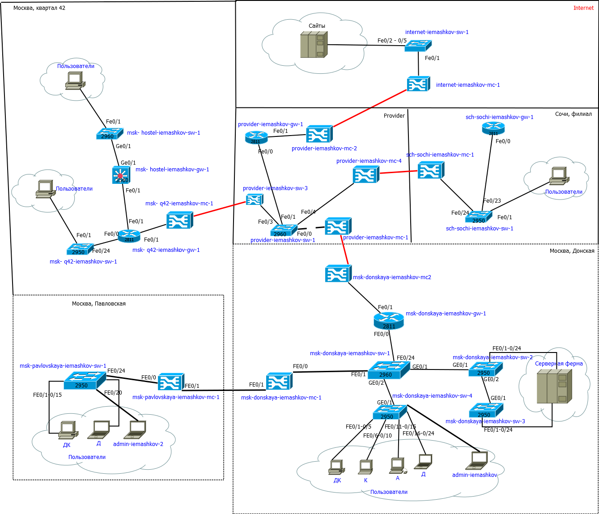
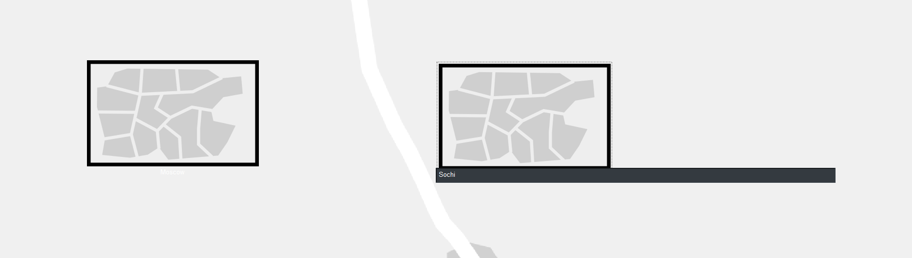
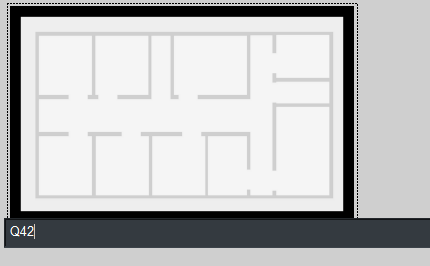
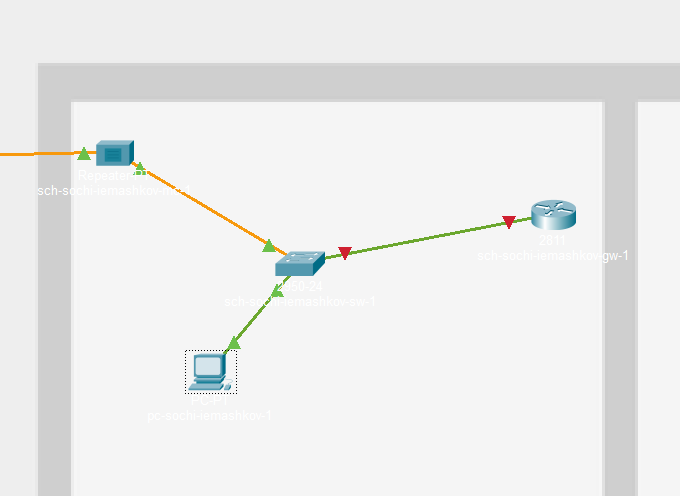
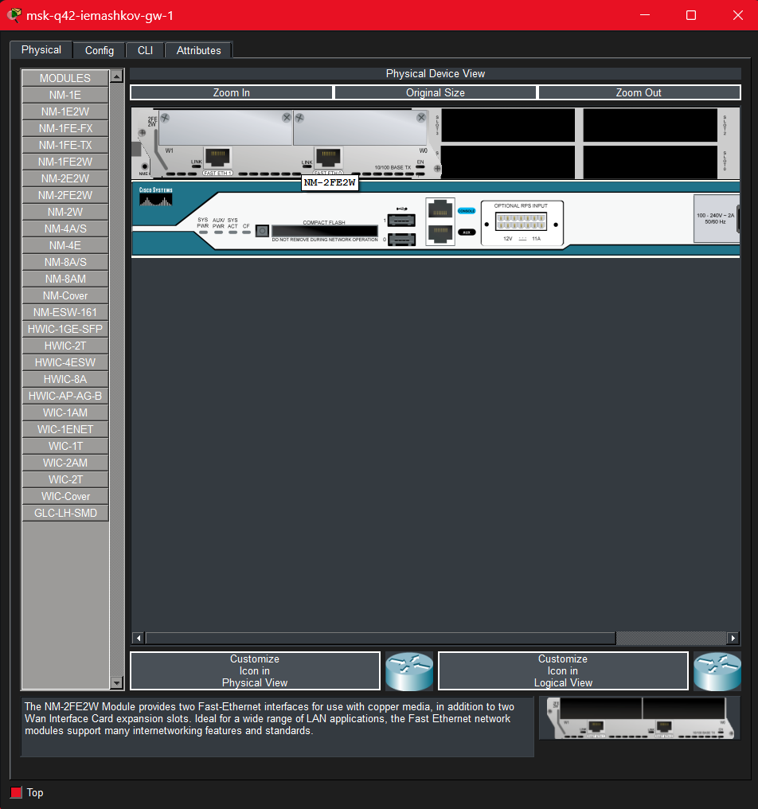

---
## Author
author:
  name: Машков Илья Евгеньевич
  email: 1132231984@yandex.ru
  affiliation:
    - name: Российский университет дружбы народов
      country: Российская Федерация
      postal-code: 117198
      city: Москва
      address: ул. Миклухо-Маклая, д. 6
## Title
title: Лабораторная работа №13
subtitle: Администрирование локальных сетей
license: CC BY
date: 2026-05-09
date-format: "YYYY-MM-DD" 
---

## Цель работы

Провести подготовительные мероприятия по организации взаимодействия через сеть провайдера посредством статической маршрутизации локальной сети с сетью основного здания, расположенного в 42-м квартале в Москве, и сетью филиала, расположенного в г. Сочи.

## Выполнение лабораторной работы

{width=70%}

## Выполнение лабораторной работы

{width=70%}

## Выполнение лабораторной работы

{width=70%}

## Выполнение лабораторной работы

{width=70%}

## Выполнение лабораторной работы

{width=70%}

## Выполнение лабораторной работы

{width=70%}

## Выполнение лабораторной работы

{width=70%}

## Выполнение лабораторной работы

{width=70%}

## Выполнение лабораторной работы

{width=70%}

## Выполнение лабораторной работы

{width=70%}

## Выполнение лабораторной работы

{width=70%}

## Выполнение лабораторной работы

{width=70%}

## Выполнение лабораторной работы

{width=70%}

## Выводы

В процессе выполнения данной лабораторной, мы добавили две новые области: Москва, Квартал 42 и Сочи, Филиал. Произвели начальную настройку "почти" всех устройств.
