---
## Author
author:
  name: Машков Илья Евгеньевич
  email: 1132231984@yandex.ru
  affiliation:
    - name: Российский университет дружбы народов
      country: Российская Федерация
      postal-code: 117198
      city: Москва
      address: ул. Миклухо-Маклая, д. 6

## Title
title: "Лабораторная работа №13"
subtitle: "Администрирование локальных сетей"
license: "CC BY"
---

# Цель работы

Провести подготовительные мероприятия по организации взаимодействия через сеть провайдера посредством статической маршрутизации локальной сети с сетью основного здания, расположенного в 42-м квартале в Москве, и сетью филиала, расположенного в г. Сочи.

# Задание

1. Внести изменения в схемы L1, L2 и L3 сети, добавив в них информацию о сети основной территории (42-й квартал в Москве) и сети филиала в г. Сочи.
2. Дополнить схему проекта, добавив подсеть основной территории организации 42-го квартала в Москве и подсеть филиала в г. Сочи.
3. Сделать первоначальную настройку добавленного в проект оборудования.
4. При выполнении работы необходимо учитывать соглашение об именовании.

# Выполнение лабораторной работы

Вношу изменения в L1 ([рис. @fig-001]), L2 ([рис. @fig-002]) и L3 ([рис. @fig-003]) схемы нашей сети .

{#fig-001 width=70%}

{#fig-002 width=70%}

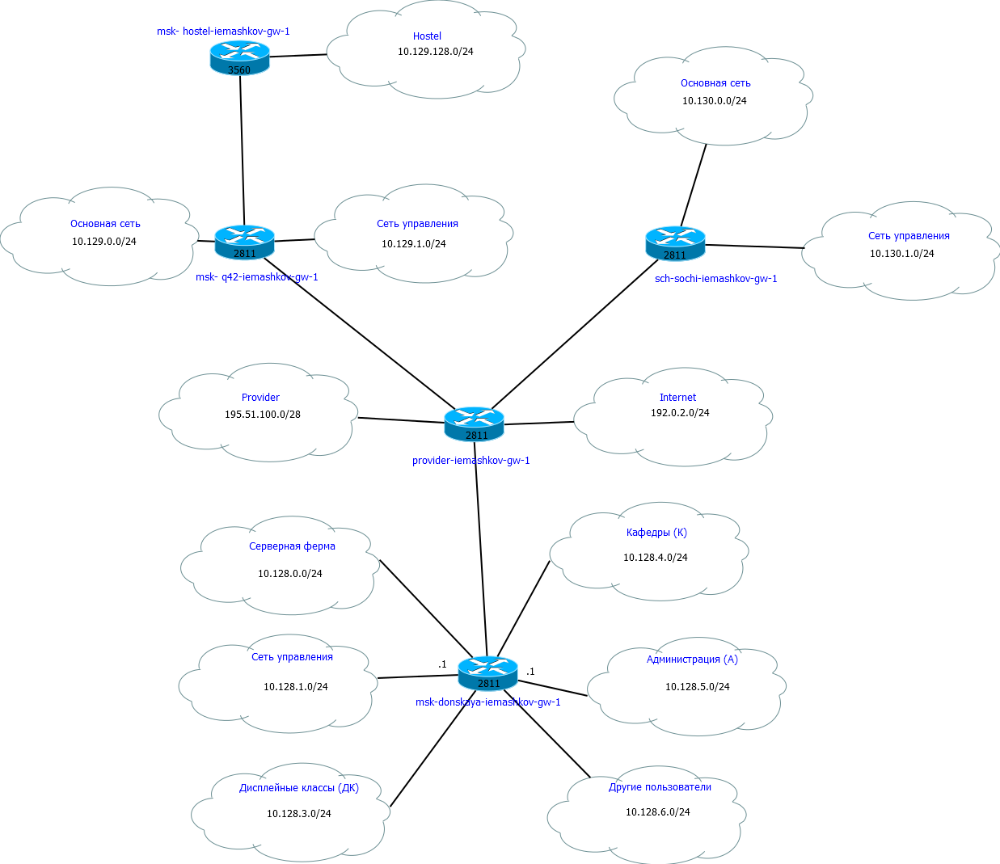{#fig-003 width=70%}

Затем захожу в Cisco и вношу изменения в нашу топологию сети, добавляя две зоны: Сочи, филиал и Москва, квартал 42 -- и все соответствующие устройства ([рис. @fig-004]).

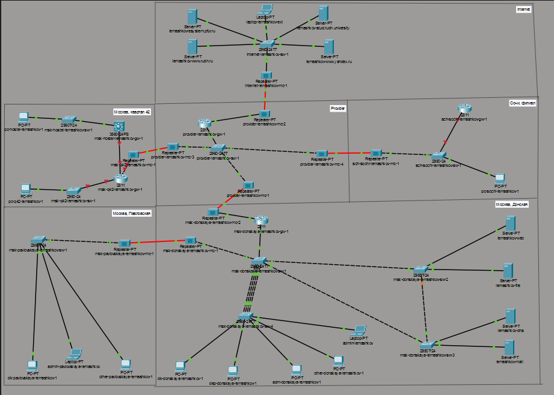{#fig-004 width=70%}

Перехожу в физическую область и добавляю город (Сочи) ([рис. @fig-005]).

{#fig-005 width=70%}

В Сочи добаляю здание(филиал) ([рис. @fig-006]).

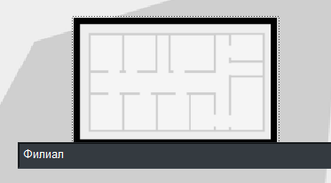{#fig-006 width=70%}

В Москве добавляю здание(квартал 42) ([рис. @fig-007]).

{#fig-007 width=70%}

Следующим образом размещаю устройства в здании квартала ([рис. @fig-008]).

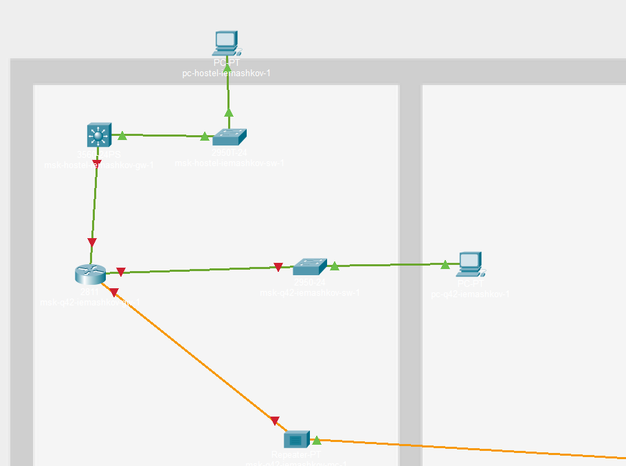{#fig-008 width=70%}

Размещение устройств в сочинском филиале ([рис. @fig-009]).

{#fig-009 width=70%}

Следующим образом выглядит связь между Москвой и Сочи ([рис. @fig-010]).

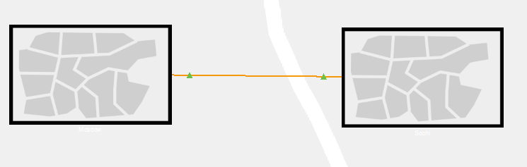{#fig-010 width=70%}

Вносим изменения в компоненты роутера в Квартале 42. Добавляем интерфейс NM-2FE2W ([рис. @fig-011]).

{#fig-011 width=70%}

Все наши повторители имеют одинаковые интерфейсы: на PT-REPEATER-
NM-1FFE и PT-REPEATER-NM-1CFE -- поэтому и в новых репитерах заменяем интерфейсы на них ([рис. @fig-012]).

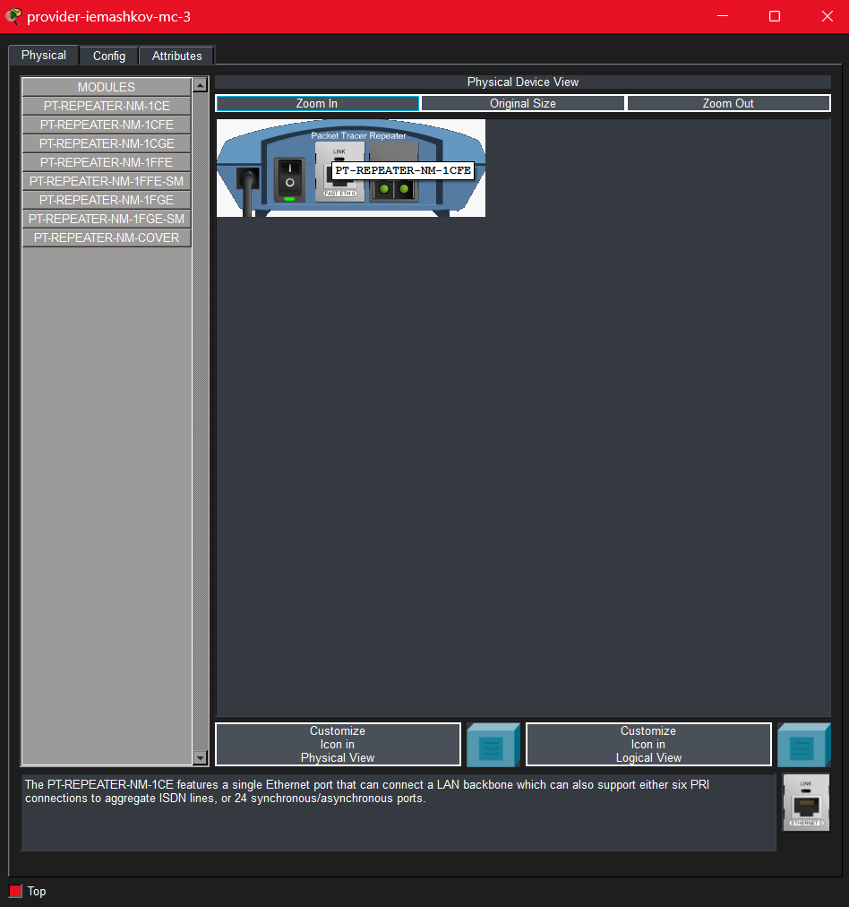{#fig-012 width=70%}

Настраиваем маршрутизатор msk-q42-iemashkov-gw-1 ([рис. @fig-013]).

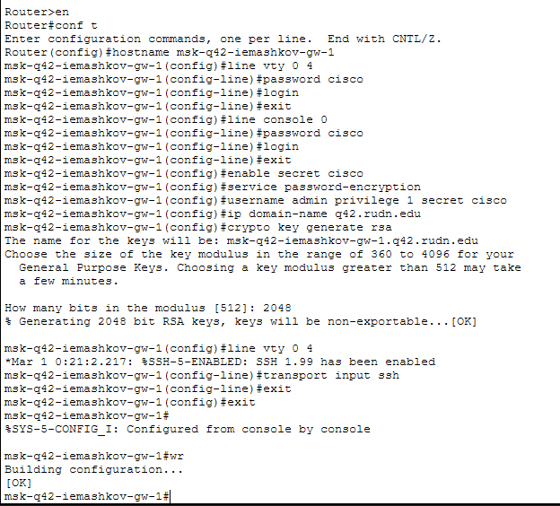{#fig-013 width=70%}

Настраиваем многоуровневый коммутатор msk-hostel-iemashkov-gw-1 ([рис. @fig-014]).

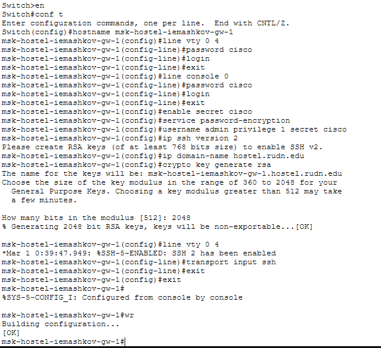{#fig-014 width=70%}

Настраиваем коммутатор msk-hostel-iemashkov-sw-1 ([рис. @fig-015]).

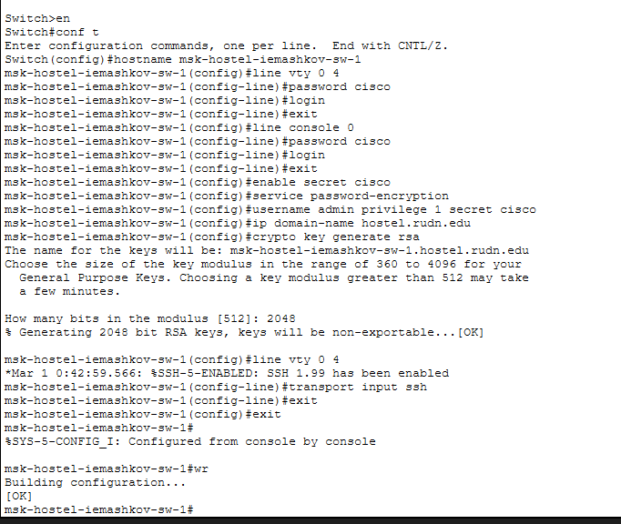{#fig-015 width=70%}

Настраиваем коммутатор sch-sochi-iemashkov-sw-1 ([рис. @fig-016]).

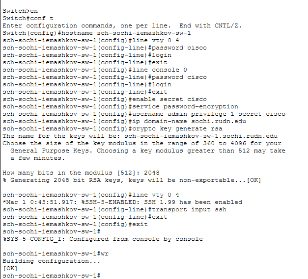{#fig-016 width=70%}

Настраиваем маршрутизатор sch-sochi-iemashkov-gw-1 ([рис. @fig-017]).

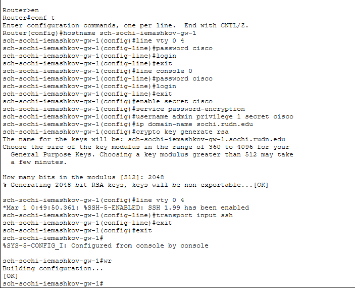{#fig-017 width=70%}

# Выводы

В процессе выполнения данной лабораторной, мы добавили две новые области: Москва, Квартал 42 и Сочи, Филиал. Произвели начальную настройку "почти" всех устройств.

