---
## Author
author:
  name: Машков Илья Евгеньевич
  email: 1132231984@yandex.ru
  affiliation:
    - name: Российский университет дружбы народов
      country: Российская Федерация
      postal-code: 117198
      city: Москва
      address: ул. Миклухо-Маклая, д. 6

## Title
title: "Лабораторная работа №14"
subtitle: "Администрирование локальных сетей"
license: "CC BY"
---

# Цель работы

Настроить взаимодействие через сеть провайдера посредством статической маршрутизации локальной сети организации с сетью основного здания, расположенного в 42-м квартале в Москве, и сетью филиала, расположенного в г. Сочи.

# Задание

1. Настроить связь между территориями.
2. Настроить оборудование, расположенное в квартале 42 в Москве.
3. Настроить оборудование, расположенное в филиале в г. Сочи.
4. Настроить статическую маршрутизацию между территориями.
5. Настроить статическую маршрутизацию на территории квартала 42 в г. Москве.
6. Настроить NAT на маршрутизаторе msk-donskaya-gw-1.
7. При выполнении работы необходимо учитывать соглашение об именовании.

# Выполнение лабораторной работы

Заходим в наш проект, переходим в коммутатор provider-sw-1 и настраиваем порты, к которым подсоединены два репитера, ведущих в Сочи и Квартал 42 ([рис. @fig-001])

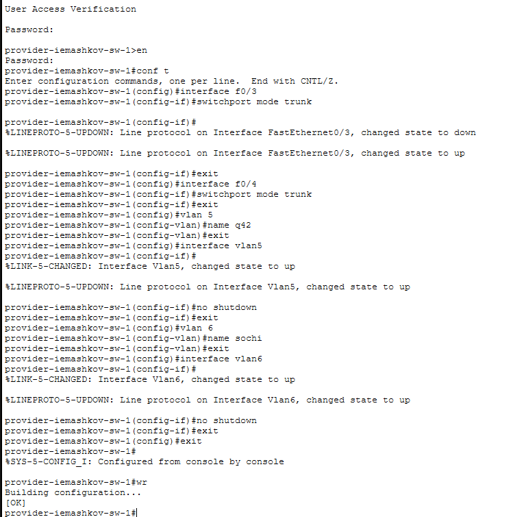{#fig-001 width=70%}

Продолжая настройку связи между территориями, переходим в маршрутизатор в Донской и настраиваем его ([рис. @fig-002])

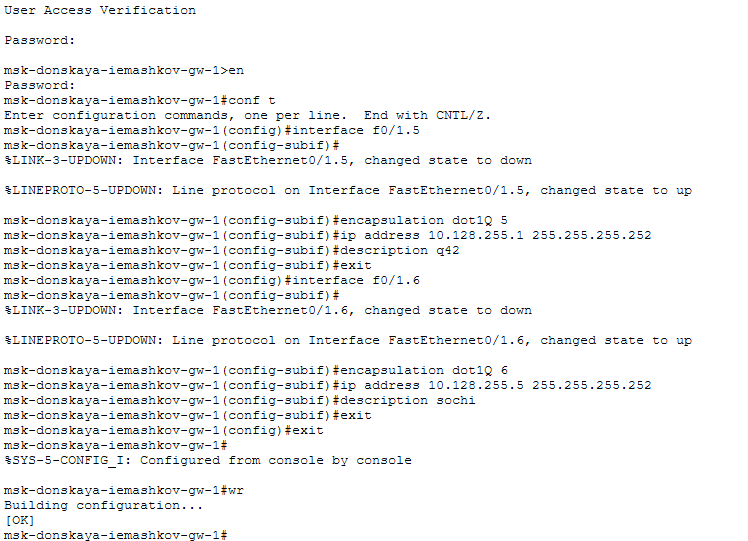{#fig-002 width=70%}

Затем переходим к маршрутизатору msk-q42-gw-1 и настраиваем порты ([рис. @fig-003])

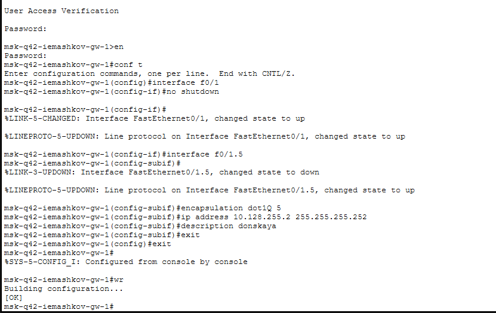{#fig-003 width=70%}

Переходим к настройки коммутатора sch-sohi-sw-1 ([рис. @fig-004]).

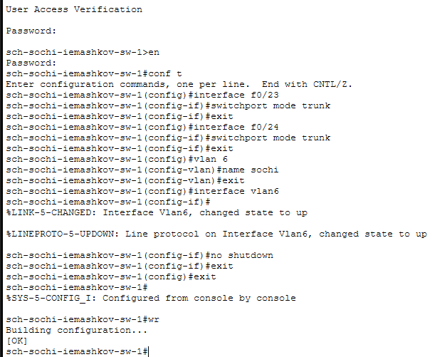{#fig-004 width=70%}

Теперь настраиваем маршрутизатор в Сочи ([рис. @fig-005]).

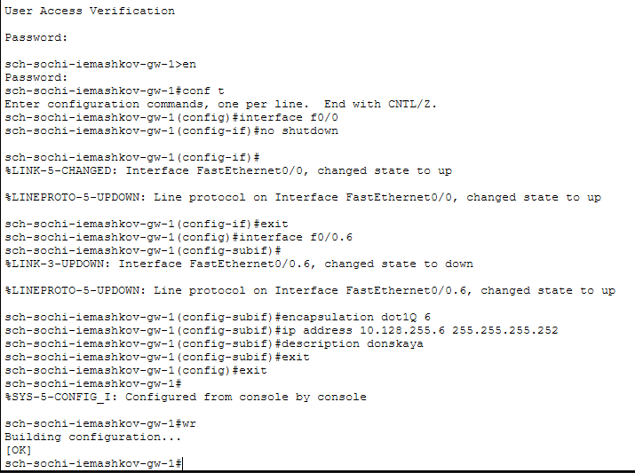{#fig-005 width=70%}

Проводим дополнительную настройку оставшихся портов маршрутизатора в Квартале 42 и vlan под них ([рис. @fig-006]).

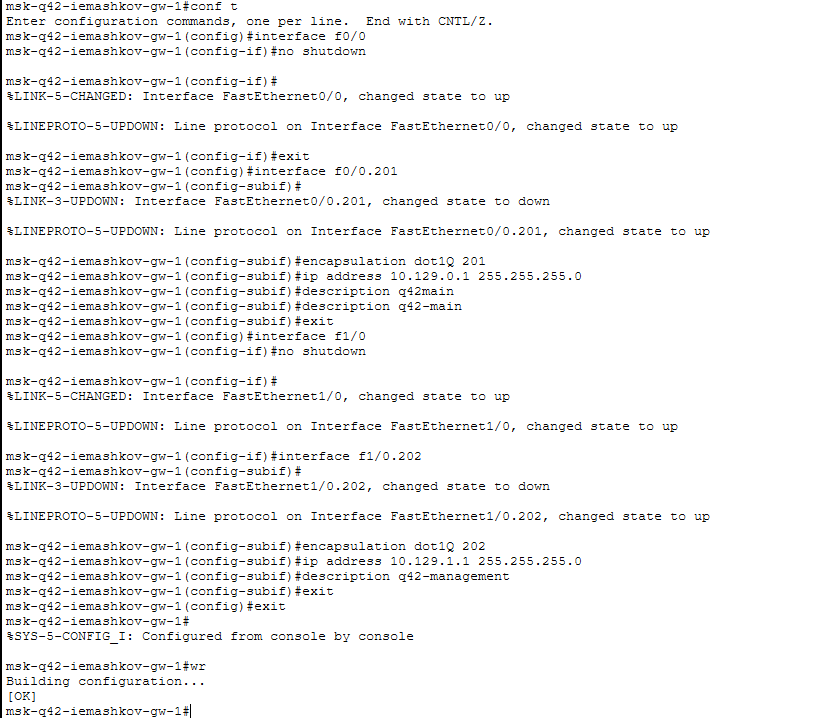{#fig-006 width=70%}

Настраиваем коммутатор в Квартале 42 ([рис. @fig-007]).

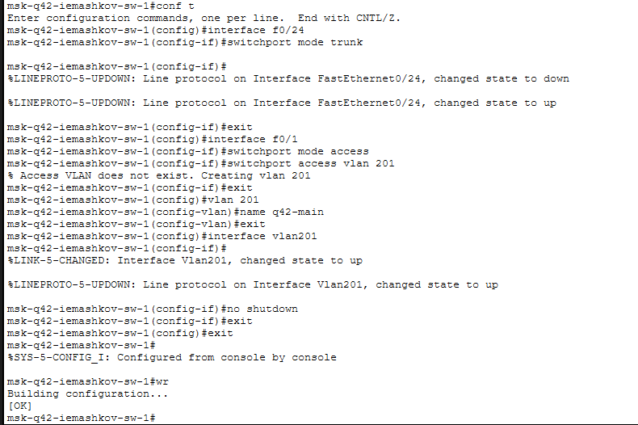{#fig-007 width=70%}

Теперь настраиваем многоуровневый коммутатор msk-hostel-gw-1 ([рис. @fig-008]).

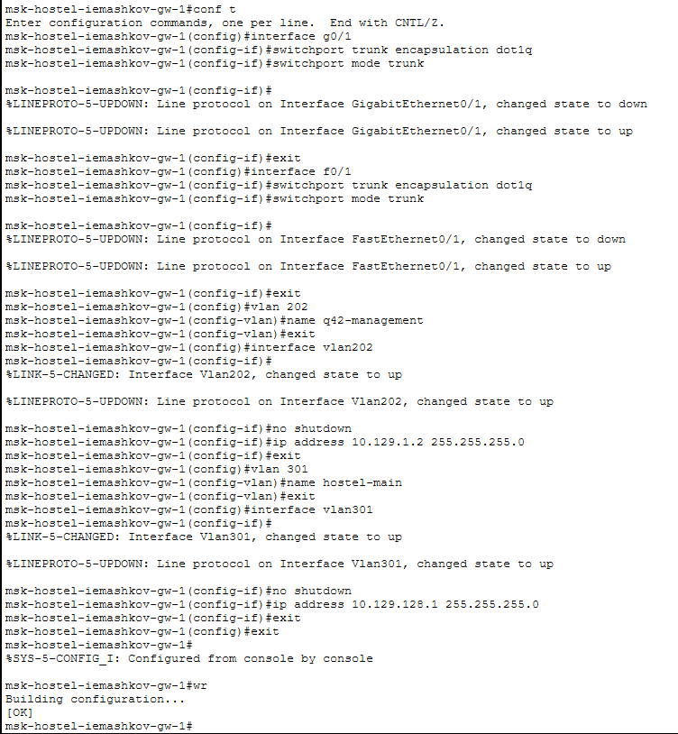{#fig-008 width=70%}

А теперь настраиваем коммутатор msk-hostel-sw-1 ([рис. @fig-009]).

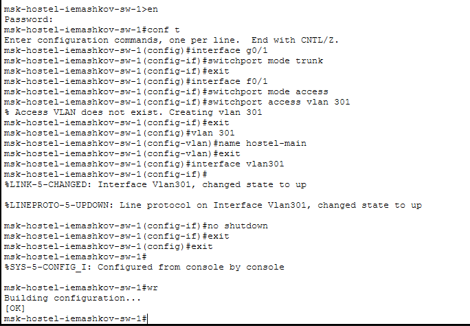{#fig-009 width=70%}

Настраиваем порты и vlan на маршрутизаторе в Сочи ([рис. @fig-010]).

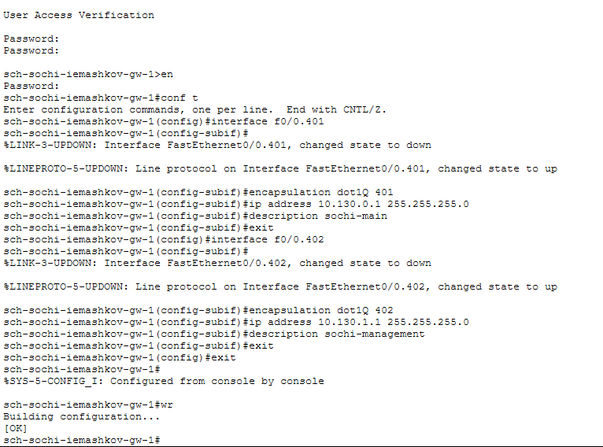{#fig-010 width=70%}

Настраиваем vlan и интерфейс под него на коммутаторе в Сочи ([рис. @fig-011]).

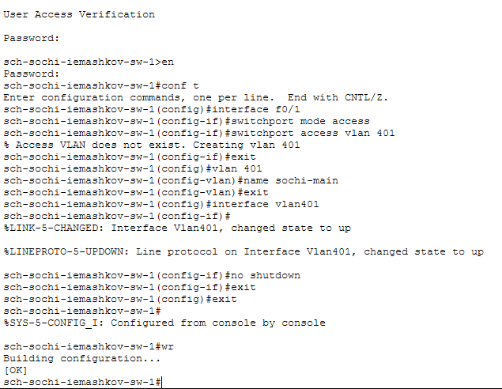{#fig-011 width=70%}

Настраиваем маршрутизацию на msk-donskaya-gw-1 ([рис. @fig-012]).

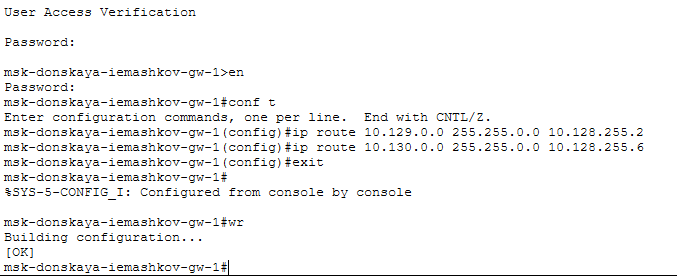{#fig-012 width=70%}

Настраиваем маршрутизацию на msk-q42-gw-1 ([рис. @fig-013]).

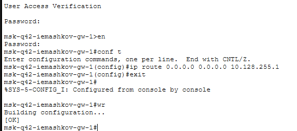{#fig-013 width=70%}

Настраиваем маршрутизацию на sch-sochi-gw-1 ([рис. @fig-014]).

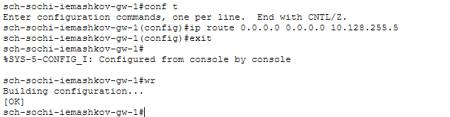{#fig-014 width=70%}

Дополнительно настраиваем маршрутизацию на msk-q42-gw-1 ([рис. @fig-015]).

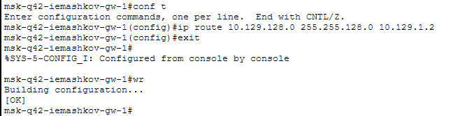{#fig-015 width=70%}

Настраиваем маршрутизацию на msk-hostel-gw-1 ([рис. @fig-016]).

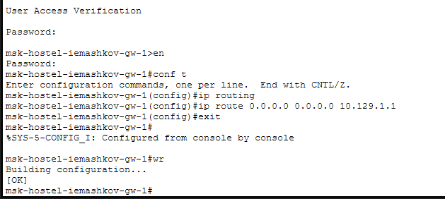{#fig-016 width=70%}

Настройка NAT на маршрутизаторе в Донской ([рис. @fig-017]).

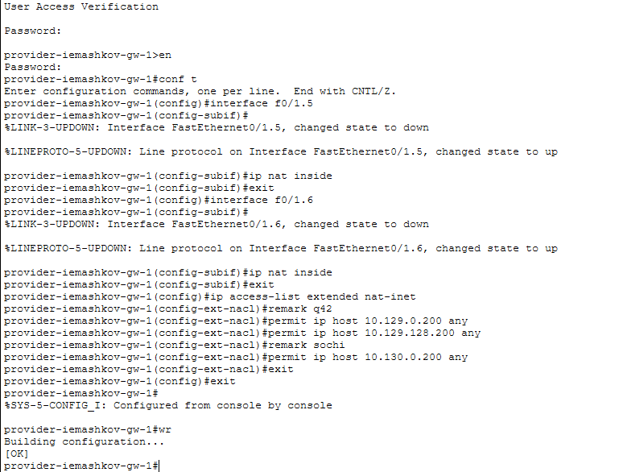{#fig-017 width=70%}

# Выводы

В процессе выполнения лабораторной работы я настроил взаимодействие через сеть провайдера посредством статической маршрутизации локальной сети организации с сетью основного здания, расположенного в 42-м квартале в Москве, и сетью филиала, расположенного в г. Сочи.
