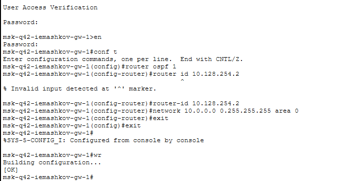
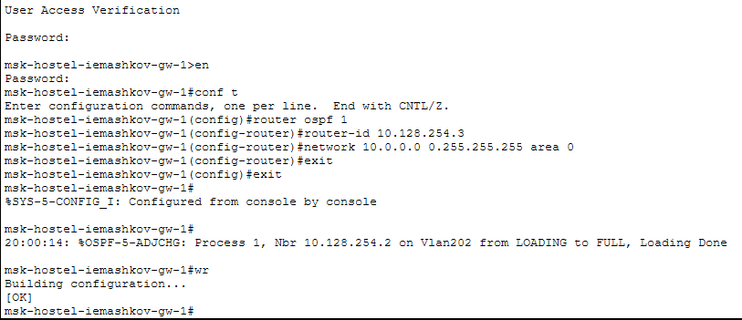
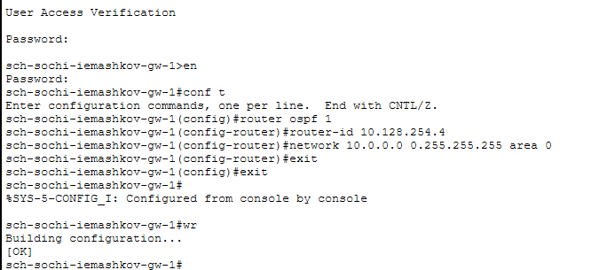
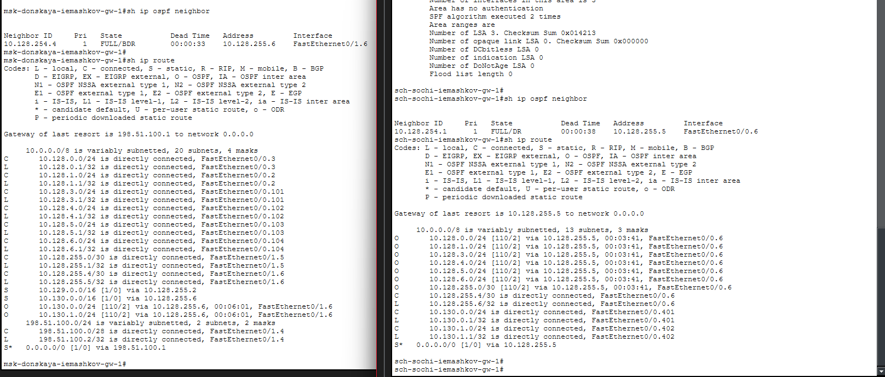
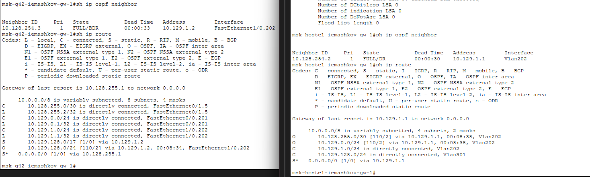
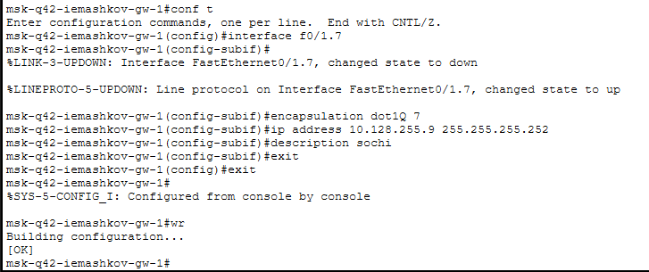
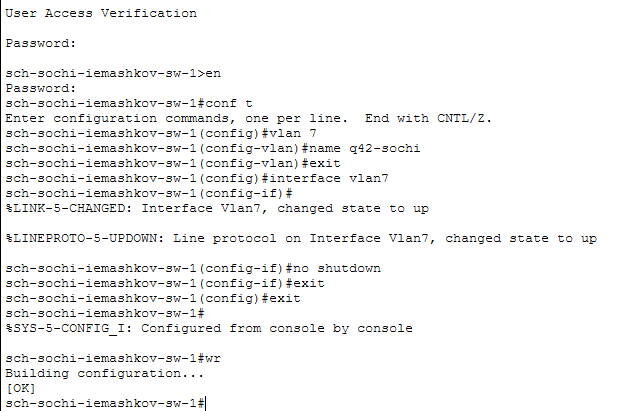
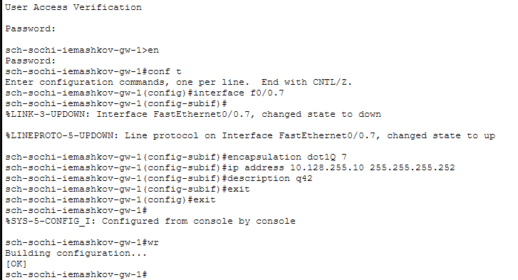
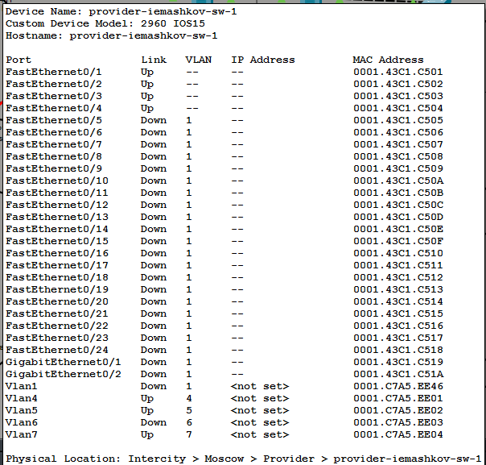

---
## Author
author:
  name: Машков Илья Евгеньевич
  email: 1132231984@yandex.ru
  affiliation:
    - name: Российский университет дружбы народов
      country: Российская Федерация
      postal-code: 117198
      city: Москва
      address: ул. Миклухо-Маклая, д. 6

## Title
title: "Лабораторная работа №15"
subtitle: "Администрирование локальных сетей"
license: "CC BY"
---

# Цель работы

Настроить динамическую маршрутизацию между территориями организации.

# Задание

1. Настроить динамическую маршрутизацию по протоколу OSPF на маршрутизаторах msk-donskaya-gw-1, msk-q42-gw-1, msk-hostel-gw-1, sch-sochi-gw-1.
2. Настроить связь сети квартала 42 в Москве с сетью филиала в г. Сочи напрямую.
3. В режиме симуляции отследить движение пакета ICMP с ноутбука администратора сети на Донской в Москве (Laptop-PT admin) до компьютера пользователя в филиале в г. Сочи pc-sochi-1.
4. На коммутаторе провайдера отключить временно vlan 6 и в режиме симуля-
ции убедиться в изменении маршрута прохождения пакета ICMP с ноутбука администратора сети на Донской в Москве (Laptop-PT admin) до компьютера пользователя в филиале в г. Сочи pc-sochi-1.
5. На коммутаторе провайдера восстановить vlan 6 и в режиме симуляции убедиться в изменении маршрута прохождения пакета ICMP с ноутбука администратора сети на Донской в Москве (Laptop-PT admin) до компьютера пользователя в филиале в г. Сочи pc-sochi-1.
6. При выполнении работы необходимо учитывать соглашение об именовании.

# Выполнение лабораторной работы

## Настройка OSPF

Переходим в логическую область нашего проекта, а затем переходим к настройке OSPF на роутере в зоне Донской ([рис. @fig-001]).

{#fig-001 width=70%}

Затем проверяем таблицы OSPF, соседей и общую таблицу путей маршрутизации ([рис. @fig-002]). Т.к. протокол настроен только на одном маршрутизаторе, соседей у него нет.

{#fig-002 width=70%}

Затем настраиваем протокол на маршрутизаторе в зоне Квартала 42 в Москве ([рис. @fig-003])

{#fig-003 width=70%}

Теперь настраиваем протокол на маршрутизирующем коммутаторе в зоне Отеля в Квартале 42 в Москве ([рис. @fig-004]).

{#fig-004 width=70%}

Затем настраиваем протокол на маршрутизаторе в зоне Филиала в Сочи ([рис. @fig-005]).

{#fig-005 width=70%}

Затем проверяем те же таблицы, что и до этого и теперь видим, что соседом для Донской является Сочи ([рис. @fig-006]), а для Квартала 42 соседом является Отель в этом же квартале ([рис. @fig-007]). Также мы видим, что в таблицах маршрутизации пути сообщения между зонами теперь имеют индекс O, что означает, что на них работает OSPF.

{#fig-006 width=70%}

{#fig-007 width=70%}

## Настройка линка между Кварталом 42 и Сочи

Чтобы настроить связь между сочи и Кварталом 42, создаём vlan7 на коммутаторе provider-sw-1 и настраиваем интерфейс под него ([рис. @fig-008]).

{#fig-008 width=70%}

Затем делаем то же самое на маршрутизаторе в Квартале 42 ([рис. @fig-009]).

{#fig-009 width=70%}

В Сочи же настраиваем vlan7 и интерфейса под него сначала на коммутаторе ([рис. @fig-010]).

{#fig-010 width=70%}

И после настройки коммутатора в Сочи, настраиваем и роутер этой же зоны ([рис. @fig-011]).

{#fig-011 width=70%}

## Проверка работы OSPF

Отправляем ICMP-запрос с laptop-admin в Донской на ПК в Сочи. Запрос уходит и возвращается исправно после первого прогона.

Затем выключаем интерфейс vlan6 на provider-sw-1 ([рис. @fig-012]). И снова отправляем тот же запрос. Маршрут поменялся: пакет два раза обращался к роутеру в Сочи, чего до этого не было. Восстановление пути заняло 24 милисекунды.

{#fig-012 width=70%}

Затем я обратно включил vlan6 и снова отправил запрос, маршрут восстановился за те же 24 милисекунды.

# Выводы

В ходе выполнения данной лабораторной работы я настроил динамическую маршрутизацию посредством настройки протокола OSPF.
