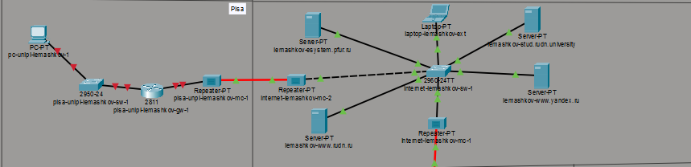
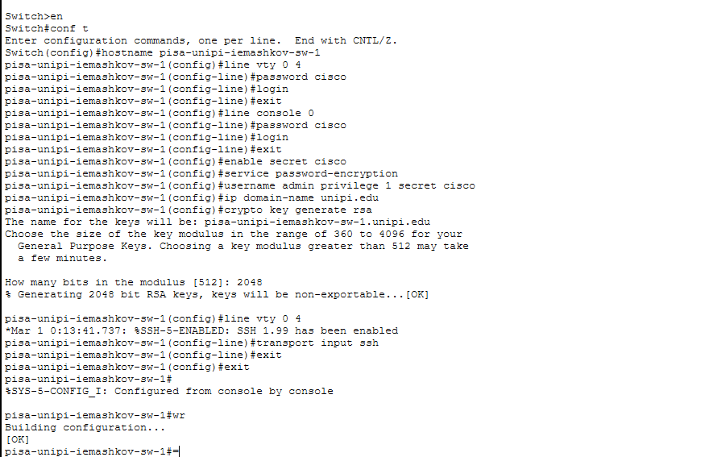
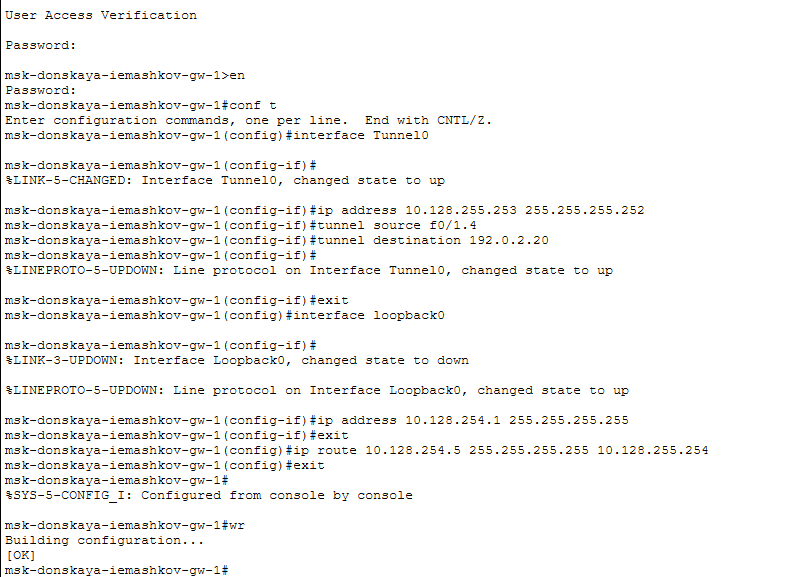
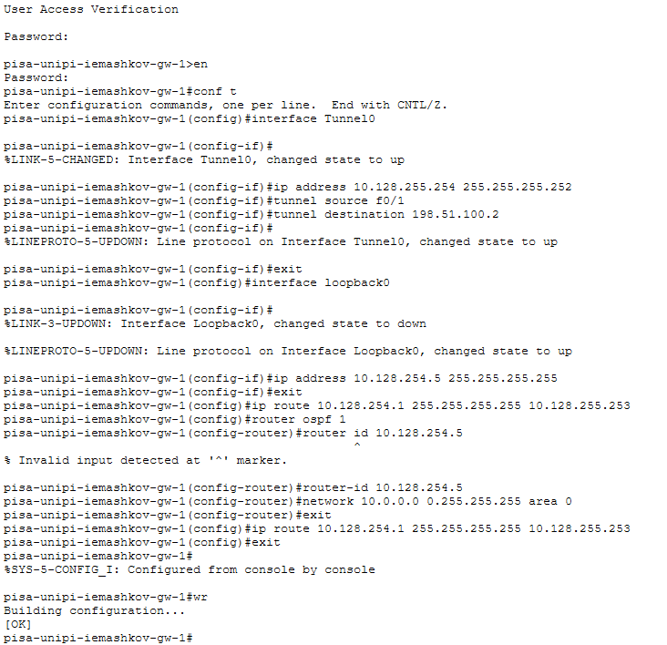

---
## Author
author:
  name: Машков Илья Евгеньевич
  email: 1132231984@yandex.ru
  affiliation:
    - name: Российский университет дружбы народов
      country: Российская Федерация
      postal-code: 117198
      city: Москва
      address: ул. Миклухо-Маклая, д. 6

## Title
title: "Лабораторная работа №16"
subtitle: "Администрирование локальных сетей"
license: "CC BY"
---

# Цель работы

Получение навыков настройки VPN-туннеля через незащищённое Интернет-соединение.

# Задание

1. Настроить VPN-туннель между сетью Университета г. Пиза (Италия) и сетью «Донская» в г. Москва .
2. При выполнении работы необходимо учитывать соглашение об именовании

# Выполнение лабораторной работы

Для начала в рабочей области проекта размещаю 2 репитера, коммутатор, маршрутизатор и ПК ([рис. @fig-001]).  

{#fig-001 width=70%} 

Затем перехожу в физическую облать проекта и добавляю новый город Пизу, а в нём здание университета ([рис. @fig-002]).

{#fig-002 width=70%}

В здании университета города Пизы размещаю все добавленные устройства следующим образом ([рис. @fig-003]). 

{#fig-003 width=70%}

Далее я произвёл стартовую настройку маршрутизатора pisa-unipi-iemashkov-gw-1 ([рис. @fig-004]).

{#fig-004 width=70%}

То же делаю и с коммутатором pisa-unipi-iemashkov-sw-1 ([рис. @fig-005]).

{#fig-005 width=70%}

Теперь перехожу к настройке интерфейсов маршрутизатора в Пизе ([рис. @fig-006]). 

{#fig-006 width=70%}

То же делаю и с коммутатором и добавляю интерфейс для vlan401 ([рис. @fig-007]).

{#fig-007 width=70%}

Теперь перехожу к настройке VPN на основе GRE на маршрутизаторе msk-donskaya-iemashkov-gw-1 ([рис. @fig-008]). 

{#fig-008 width=70%}

Такую же процедуру произвожу и на pisa-unipi-iemashkov-gw-1 ([рис. @fig-009]).

{#fig-009 width=70%}

На время проверки соединения решил выдать ip-адрес для ПК в Пизе ([рис. @fig-010]). 

{#fig-010 width=70%}

Затем произвожу проверку соединение с ноутбука администратора в Донской ([рис. @fig-011]). Пингую ПК в Пизе и адрес туннеля. 

{#fig-011 width=70%}

# Выводы

За время выполнения данной лабораторной работы я освоил навыки настройки vpn-туннеля через незащищённое интернет соединение.
